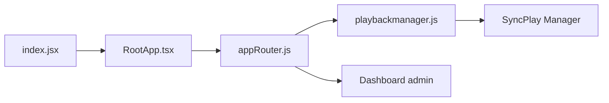

# jellyfin/jellyfin-web

> Interface web du serveur multimédia Jellyfin, base de la plupart des clients utilisateurs.

## Le problème
Le serveur Jellyfin a besoin d'un front pour parcourir la bibliothèque, lire les médias et administrer.

## Ce que ça fait vraiment
Frontend servant navigateurs, Android et iOS : connexion au serveur, navigation, recherche, Live TV, lecture, SyncPlay (lecture partagée) et tableau de bord d'administration (tâches planifiées, sauvegardes, plugins). Il ne fonctionne qu'avec un serveur Jellyfin.

## Comment c'est branché


## Essayer
```sh
git clone https://github.com/jellyfin/jellyfin-web.git
cd jellyfin-web
npm install
npm start
npm run build:development
```

## Coût et pièges
Gratuit. Node.js et npm requis ; un serveur Jellyfin est nécessaire pour tout test réel.

## Ce que ce n'est pas
Pas le serveur, et pas un lecteur autonome. Le README cible les contributeurs, pas l'installation utilisateur.

## Alternatives
Aucune citée dans le README.

## Pour toi
Hors périmètre data/IA : à ignorer sauf contribution au projet Jellyfin.

