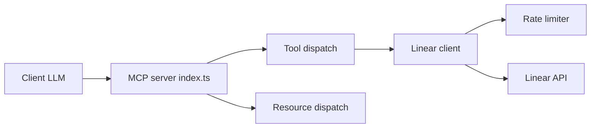

# jerhadf/linear-mcp-server

> Serveur MCP donnant à un LLM accès aux tickets Linear ; déprécié au profit du serveur officiel.

## Le problème
Un assistant IA ne peut pas créer ni rechercher des tickets Linear sans pont vers son API.

## Ce que ça fait vraiment
Serveur stdio qui expose cinq outils (créer, mettre à jour, rechercher des tickets, tickets d'un utilisateur, commentaires) et des ressources (ticket, équipe, utilisateur, organisation). Tout est dans `index.ts`, avec limiteur de débit. Le README annonce qu'il n'est plus maintenu.

## Comment c'est branché


## Essayer
```bash
npx @smithery/cli install linear-mcp-server --client claude
npm install
npm run build
```

## Coût et pièges
Gratuit ; nécessite une clé d'API Linear. Aucune maintenance depuis mai 2025.

## Ce que ce n'est pas
Plus maintenu : l'auteur recommande le serveur MCP distant officiel de Linear (mcp.linear.app/sse).

## Alternatives
- Serveur MCP officiel de Linear : la voie recommandée par l'auteur.

## Pour toi
À ignorer : déprécié par son auteur ; utilise le serveur officiel de Linear.

