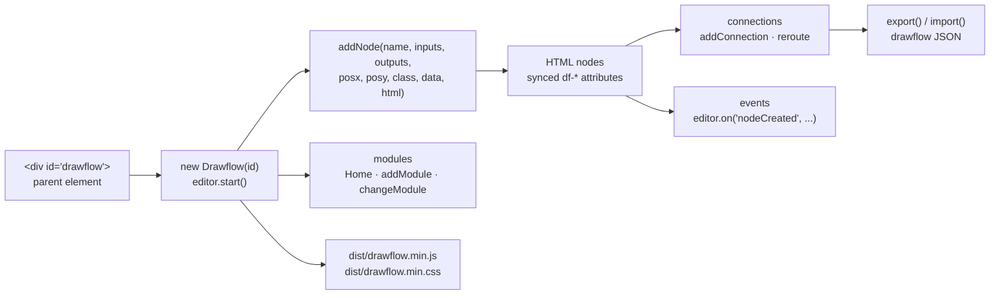

# jerosoler/Drawflow

> **A browser flow-graph editor in dependency-free JavaScript, to embed in your own page.**

## The problem

As soon as an application has to let users compose a processing chain — wire a source into a
transform, then into an output — you need a canvas of draggable nodes, connectors that follow
them, zooming and serialisation. Writing that by hand turns into weeks of mouse event handling,
SVG curves and keeping the DOM in step with the state. Ready-made solutions, meanwhile, often
arrive tied to one UI framework or to a hosted service.

## What it actually does

Drawflow is a vanilla JavaScript library ("No dependencies", per the README) that turns a
`<div>` into a flow editor. You instantiate `new Drawflow(id)`, call `start()`, and add nodes
with `addNode(name, inputs, outputs, posx, posy, class, data, html)` — a node's content is HTML
supplied by the caller.

What the library handles, from the README's feature list: dragging nodes, multiple inputs and
outputs, multiple connections, adding and removing inputs/outputs and connections, reroute
points on a line (double click), zoom (`Ctrl` + wheel, pinch on mobile), and three editor modes,
`edit`, `fixed` and `view`.

Two mechanisms shape the usage. First, **data sync**: a `df-*` attribute on an `input`,
`textarea`, `select` or a `contenteditable` element binds the field to the node's `data` object,
with multiple parents supported through `df-*-*`. Second, **modules**: `addModule`,
`changeModule` and `removeModule` separate several flows inside the same editor, the default
module being `Home`.

The whole state serialises to JSON through `export()` and loads back through `import()` — the
README shows the exact document shape, with each node's position, class, HTML and connections.
Around thirty events (`nodeCreated`, `connectionCreated`, `nodeDataChanged`, `zoom`,
`translate`, `import`, `export` and more) are subscribed to via `editor.on(...)`. Nodes can be
registered ahead of time and reused (`registerNode`), including as Vue 2 or Vue 3 components,
with a note on Nuxt integration.

## How it is wired



No code-derived diagram exists for this repository: the graph above is reconstructed from the
README alone. The only two shipped files you ever reference are `dist/drawflow.min.js` and
`dist/drawflow.min.css`; everything else is API called from your own code.

## Trying it

```javascript
npm i drawflow
```

```javascript
import Drawflow from 'drawflow'
import styleDrawflow from 'drawflow/dist/drawflow.min.css'
```

Without a build tool, the README gives the CDN route:

```html
# Last
<link rel="stylesheet" href="https://cdn.jsdelivr.net/gh/jerosoler/Drawflow/dist/drawflow.min.css">
<script src="https://cdn.jsdelivr.net/gh/jerosoler/Drawflow/dist/drawflow.min.js"></script>
```

Then the parent element and the start call:

```html
<div id="drawflow"></div>
```

```javascript
var id = document.getElementById("drawflow");
const editor = new Drawflow(id);
editor.start();
```

A first node, exactly as written in the README:

```javascript
var html = `
<div><input type="text" df-name></div>
`;
var data = { "name": '' };

editor.addNode('github', 0, 1, 150, 300, 'github', data, html);
```

Full examples live in the repository's `docs` folder, including `docs/drawflow-element.html`
for use as a custom element based on LitElement. A direct clone is documented too:
`git clone https://github.com/jerosoler/Drawflow.git`.

## Cost and pitfalls

- **Nothing to pay, nothing to host**: MIT licence, an npm package, no declared dependencies, no
  third-party service. The cost is integration time, not infrastructure.
- **TypeScript types live outside the repository**: the README points to an external package,
  `npm install -D @types/drawflow`, and to issue #119. So the maintainer does not guarantee the
  types match the version you installed.
- **The nodes' HTML is yours to write**: `addNode` takes a raw HTML string. Whatever the user
  sees inside a node, you author and style yourself — and that string is serialised as-is into
  the JSON export, which makes the exported state depend on your markup.
- **Vue needs explicit wiring**: you pass the `Vue` object as the constructor's second argument,
  differently for Vue 2 and Vue 3 (`{ version: 3, h, render }` plus the instance's
  `appContext`), and Nuxt requires `transpile: ['drawflow']` in `nuxt.config.js`.
- **Some options must be set before `start()` or `import()`**: the README says so for `reroute`,
  and the editor mode is to be set "before start". Setting an option too late produces no
  documented error.
- **`useuuid` is not retroactive**: it only affects newly created nodes, not imported ones.
  Mixing both id regimes in one document is a trap.
- **A one-person repository**: a single author, a personal Twitter badge. The code is short and
  readable, but the project's continuity rests on one maintainer — that is the alert kept here.

## What it is not

- **It is not a flow execution engine.** Drawflow draws and serialises a graph; it runs nothing,
  schedules nothing, calls no service. The `export()` JSON is a description document — it is
  your code's job to read it and do something with it. The node named `github` in the README's
  example does not talk to GitHub.
- **It is not a general diagramming tool**: no free shapes, no floating text, no annotations.
  The model is fixed — nodes with numbered inputs and outputs, joined by curves.
- **It is not a ready-made application**: there is no sidebar, node palette, file handling or
  persistence. The live demo and the `docs` folder show an assembly, they do not ship one.
- **It is not a Vue or React component**: it is JavaScript manipulating the DOM, with an
  optional hook for rendering Vue components *inside* nodes. React is nowhere in the README.
- **There is no domain validation**: nothing stops you connecting any output to any input.
  Compatibility rules between node types are yours to write on top, through the events.

## Alternatives

No comparable alternative in the catalogue. The neighbours suggested for this repository
(`prettier/prettier`, `marktext/marktext`, `codesandbox/codesandbox-client`,
`phcode-dev/phoenix`) are a code formatter, a Markdown editor and two development environments:
the neighbourhood was computed on shared JavaScript vocabulary, not on function, and none of
them offers an embeddable node canvas. The README itself names no competing project — only
LitElement, cited as the basis of one integration example, and `@types/drawflow`, a complement
rather than a substitute.

## For you

Useful the day an interface has to expose a chain of processing steps to someone who does not
write code: an ingestion chain, a preprocessing pipeline, prompt routing, agent composition. It
is the drawing layer and nothing more, and that is exactly what makes it reusable: the exported
JSON becomes your own graph schema, which your Python engine then executes however it likes.
Skip it if you are looking for an orchestrator or a turnkey application — here, everything
behind the canvas is still yours to write.
