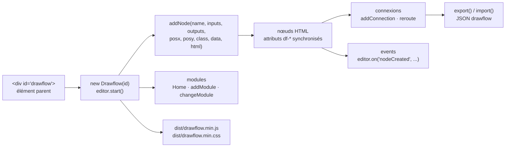

# jerosoler/Drawflow

> **Éditeur de graphes de flux dans le navigateur, en JavaScript sans dépendance, à intégrer dans sa propre page.**

## Le problème

Dès qu'une application doit laisser l'utilisateur composer une chaîne de traitement — brancher
une source sur une transformation, puis sur une sortie — il faut un canevas de nœuds
déplaçables, des connecteurs qui suivent, un zoom, une sérialisation. Écrire cela à la main
part sur des semaines de gestion d'événements souris, de courbes SVG et de synchronisation
entre le DOM et l'état. Les solutions toutes faites, elles, arrivent souvent liées à un cadre
d'interface précis ou à un service hébergé.

## Ce que ça fait vraiment

Drawflow est une bibliothèque JavaScript *vanilla* (« No dependencies » selon le README) qui
transforme un `<div>` en éditeur de flux. On instancie `new Drawflow(id)`, on appelle
`start()`, et on ajoute des nœuds par `addNode(name, inputs, outputs, posx, posy, class, data,
html)` — le contenu d'un nœud est du HTML fourni par l'appelant.

Ce que la bibliothèque prend en charge, d'après la liste de fonctionnalités du README :
déplacement des nœuds, entrées et sorties multiples, connexions multiples, ajout et suppression
d'entrées/sorties et de connexions, points de reroutage sur une ligne (double clic), zoom
(`Ctrl` + molette, pincement sur mobile), et trois modes d'éditeur `edit`, `fixed`, `view`.

Deux mécanismes structurent l'usage. D'une part la **synchronisation de données** : un attribut
`df-*` posé sur un `input`, `textarea`, `select` ou un élément `contenteditable` relie le champ
à l'objet `data` du nœud, avec support des parents multiples via `df-*-*`. D'autre part les
**modules** : `addModule`, `changeModule`, `removeModule` séparent plusieurs flux dans le même
éditeur, le module par défaut s'appelant `Home`.

L'état complet se sérialise en JSON par `export()` et se recharge par `import()` — le README
montre la forme exacte du document, avec position, classe, HTML et connexions de chaque nœud.
Une trentaine d'événements (`nodeCreated`, `connectionCreated`, `nodeDataChanged`, `zoom`,
`translate`, `import`, `export`…) s'écoutent par `editor.on(...)`. Les nœuds peuvent être
enregistrés d'avance et réutilisés (`registerNode`), y compris sous forme de composant Vue 2 ou
Vue 3, avec une note d'intégration Nuxt.

## Comment c'est branché



Aucun diagramme tiré du code n'existe pour ce dépôt : ce schéma est reconstruit depuis le seul
README. Les deux seuls fichiers livrés qu'on référence sont `dist/drawflow.min.js` et
`dist/drawflow.min.css` ; tout le reste est de l'API appelée depuis son propre code.

## Essayer

```javascript
npm i drawflow
```

```javascript
import Drawflow from 'drawflow'
import styleDrawflow from 'drawflow/dist/drawflow.min.css'
```

Sans outil de construction, le README donne la voie CDN :

```html
# Last
<link rel="stylesheet" href="https://cdn.jsdelivr.net/gh/jerosoler/Drawflow/dist/drawflow.min.css">
<script src="https://cdn.jsdelivr.net/gh/jerosoler/Drawflow/dist/drawflow.min.js"></script>
```

Puis l'élément parent et le démarrage :

```html
<div id="drawflow"></div>
```

```javascript
var id = document.getElementById("drawflow");
const editor = new Drawflow(id);
editor.start();
```

Un premier nœud, tel qu'écrit dans le README :

```javascript
var html = `
<div><input type="text" df-name></div>
`;
var data = { "name": '' };

editor.addNode('github', 0, 1, 150, 300, 'github', data, html);
```

Les exemples complets sont dans le dossier `docs` du dépôt, dont `docs/drawflow-element.html`
pour un usage en élément personnalisé basé sur LitElement. Le clone direct est aussi documenté :
`git clone https://github.com/jerosoler/Drawflow.git`.

## Coût et pièges

- **Rien à payer, rien à héberger** : licence MIT, paquet npm, aucune dépendance annoncée,
  aucun service tiers. Le coût est du temps d'intégration, pas d'infrastructure.
- **Les types TypeScript sont hors du dépôt** : le README renvoie à un paquet externe,
  `npm install -D @types/drawflow`, et à l'issue #119. Ce n'est donc pas le mainteneur qui
  garantit la conformité des types à la version installée.
- **Le HTML des nœuds est à ta charge** : `addNode` prend une chaîne HTML brute. Ce que
  l'utilisateur voit dans un nœud, tu l'écris et tu le styles toi-même ; et cette chaîne est
  sérialisée telle quelle dans l'export JSON, ce qui rend l'état exporté dépendant de ton
  balisage.
- **Vue demande un câblage explicite** : on passe l'objet `Vue` en second argument du
  constructeur, différemment selon Vue 2 et Vue 3 (`{ version: 3, h, render }` plus le
  `appContext` de l'instance), et Nuxt exige `transpile: ['drawflow']` dans `nuxt.config.js`.
- **Options à poser avant `start()` ou `import()`** : le README le précise pour `reroute`, et le
  mode d'éditeur se règle « before start ». Poser une option trop tard ne produit pas d'erreur
  documentée.
- **`useuuid` n'agit pas rétroactivement** : il ne concerne que les nœuds nouvellement créés,
  pas ceux importés. Mélanger les deux régimes d'identifiants sur un même document est un piège.
- **Dépôt porté par une personne** : un auteur unique, un compte Twitter personnel en badge. Le
  code est court et lisible, mais la continuité du projet tient à un seul mainteneur — c'est
  l'alerte retenue.

## Ce que ce n'est pas

- **Ce n'est pas un moteur d'exécution de flux.** Drawflow dessine et sérialise un graphe ; il
  n'exécute rien, n'ordonnance rien, n'appelle aucun service. Le JSON d'`export()` est un
  document de description — c'est à ton code d'aller le lire et d'en faire quelque chose. Le
  nœud nommé `github` dans l'exemple du README ne parle pas à GitHub.
- **Ce n'est pas un outil de diagramme généraliste** : pas de formes libres, pas de texte
  flottant, pas d'annotations. Le modèle est fixe — des nœuds à entrées et sorties numérotées,
  reliés par des courbes.
- **Ce n'est pas une application prête à l'emploi** : il n'y a pas de barre latérale, de
  palette de nœuds, de gestion de fichiers ni de persistance. La démo en ligne et le dossier
  `docs` montrent un assemblage, ils ne le livrent pas.
- **Ce n'est pas un composant Vue ni React** : c'est du JavaScript qui manipule le DOM, avec un
  point d'entrée facultatif pour rendre des composants Vue *dans* les nœuds. React n'est
  mentionné nulle part dans le README.
- **La validation métier n'existe pas** : rien n'empêche de brancher n'importe quelle sortie sur
  n'importe quelle entrée. Les règles de compatibilité entre nœuds sont à écrire au-dessus, via
  les événements.

## Alternatives

Aucune alternative comparable dans le catalogue. Les voisins proposés pour ce dépôt
(`prettier/prettier`, `marktext/marktext`, `codesandbox/codesandbox-client`,
`phcode-dev/phoenix`) sont un formateur de code, un éditeur Markdown et deux environnements de
développement : le voisinage a été calculé sur le lexique JavaScript commun, pas sur la
fonction, et aucun d'eux ne propose de canevas de nœuds à intégrer dans une page. Le README lui
même ne nomme aucun projet concurrent — seulement LitElement, cité comme base d'un exemple
d'intégration, et `@types/drawflow`, un complément et non un substitut.

## Pour toi

Utile le jour où une interface doit exposer un enchaînement de traitements à quelqu'un qui
n'écrit pas de code : chaîne d'ingestion, pipeline de prétraitement, routage de prompts,
composition d'agents. C'est la couche de dessin, rien de plus, et c'est précisément ce qui la
rend réutilisable : le format JSON exporté devient ton propre schéma de graphe, que ton moteur
Python exécute ensuite comme il l'entend. À écarter si tu cherches un orchestrateur ou une
application clés en main — ici tout ce qui vit derrière le canevas reste à écrire.
