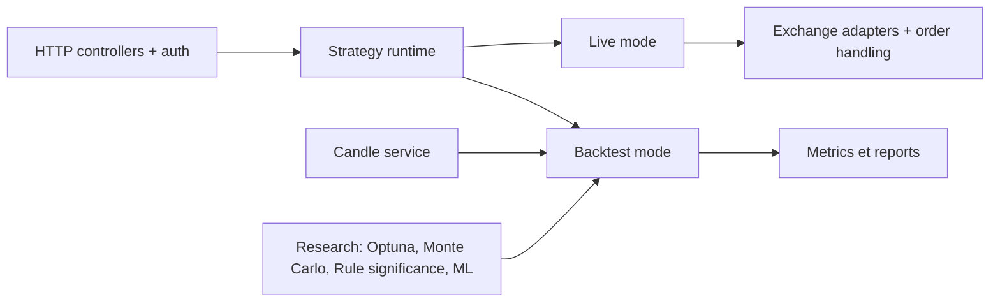

# jesse-ai/jesse

> Framework Python de trading crypto pour rechercher, backtester, optimiser et déployer ses propres stratégies.

## Le problème
Écrire et valider une stratégie de trading demande de mêler données, indicateurs, simulation sans biais de anticipation et exécution réelle.

## Ce que ça fait vraiment
On définit une stratégie en Python (`should_long`, `go_long`), puis on la backteste, on l'optimise (Optuna, Ray), on la déploie en papier ou en réel. Il inclut plus de 300 indicateurs (implémentation Rust), un test de significativité de règle, une analyse Monte Carlo, un pipeline de machine learning (scikit-learn), une API de recherche pour notebooks Jupyter et un serveur MCP local. Le tout est auto-hébergé, avec graphiques interactifs et notifications.

## Comment c'est branché

## Essayer
Aucune commande documentée dans le README : il renvoie à la section « getting started » de la documentation en ligne.

## Coût et pièges
Gratuit et auto-hébergé, mais l'architecture décrite d'après le code cite Redis (pub/sub) et des places de marché. Le README avertit : usage à ses risques, logiciel éducatif, bugs possibles, aucune garantie, ne pas risquer d'argent que l'on ne peut perdre.

## Ce que ce n'est pas
Ce n'est pas un système qui garantit un gain : le backtest ne prédit pas le futur. L'apprentissage par renforcement est annoncé « coming soon », pas livré.

## Alternatives
TA-Lib : nommé comme référence de vitesse pour les seuls indicateurs.

## Pour toi
Surveiller : ses briques (Monte Carlo, ML, API de recherche, MCP) parlent à un profil data/IA, mais l'installation n'est pas décrite ici et la finance à risque demande prudence.

