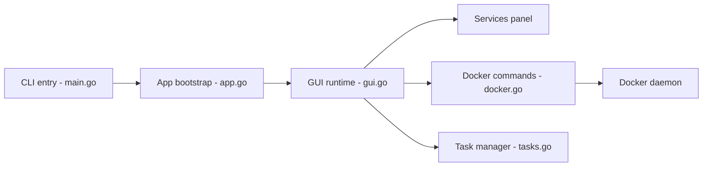

# jesseduffield/lazydocker

> Interface terminal pour Docker et Docker Compose : conteneurs, logs, métriques et actions en une touche.

## Le problème
Suivre ses conteneurs oblige à enchaîner `docker-compose ps`, `logs`, `restart` dans plusieurs terminaux, en retenant les commandes.

## Ce que ça fait vraiment
Un TUI en Go (gocui) affiche l'état des conteneurs et services, leurs logs, des graphes ASCII de métriques personnalisables, et permet d'attacher, redémarrer, supprimer, reconstruire, voir les couches d'une image et purger conteneurs/images/volumes. Souris prise en charge.

## Comment c'est branché


## Essayer
```bash
brew install jesseduffield/lazydocker/lazydocker
go install github.com/jesseduffield/lazydocker@latest
lazydocker
```

## Coût et pièges
Gratuit. Requiert Docker ≥ 29.0.0 ; Compose ≥ 1.23.2 optionnel. Les logs sont limités à la dernière heure par défaut ; dans un conteneur Docker, logs et CPU sont un bug connu.

## Ce que ce n'est pas
Pas un outil de création/configuration de conteneurs : il gère l'existant. Pas d'interface web.

## Alternatives
- docui : plutôt pour créer et configurer des conteneurs.
- Portainer : même besoin dans le navigateur, avec Swarm.

## Pour toi
À adopter : gain de temps immédiat pour qui jongle avec des stacks Docker en local (serveurs d'inférence, bases), sans coût ni dépendance.

