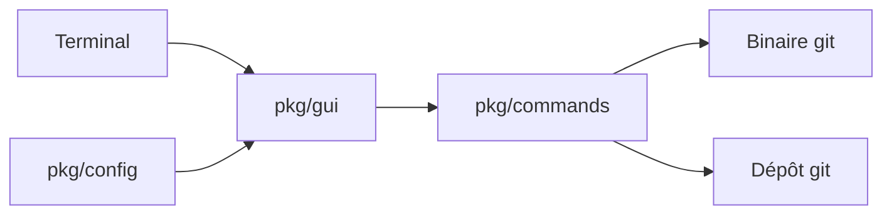

# jesseduffield/lazygit

> Interface terminal pour git : indexer des lignes, rebaser, cherry-picker sans mémoriser les commandes.

## Le problème
Les opérations git avancées (indexation partielle, rebase interactif, édition d'anciens commits) demandent des commandes longues ou l'édition manuelle de fichiers.

## Ce que ça fait vraiment
lazygit affiche dépôt, branches, commits et diff dans un écran de terminal. On indexe des lignes ou des hunks, on lance un rebase interactif (squash, fixup, drop), on fait des cherry-pick, un bisect, des worktrees, et un annuler/rétablir basé sur le reflog. Des commandes personnalisées sont définies en configuration.

## Comment c'est branché


## Essayer
```bash
brew install lazygit
lazygit --version
lazygit
```

## Coût et pièges
Gratuit. L'affichage des pull requests GitHub demande `gh` installé et `gh auth login`. L'annulation (`z`) passe par le reflog : elle ne couvre ni l'arbre de travail ni le stash.

## Ce que ce n'est pas
Ce n'est pas un remplaçant de git : il pilote le binaire git présent. L'option « nuke » supprime vraiment les changements locaux.

## Alternatives
- GitUI, tig, GitArbor TUI : cités dans le README comme autres interfaces terminal.

## Pour toi
Adopter : le versionnage de notebooks et de code MLOps gagne à un rebase propre, et l'outil ne coûte qu'un binaire.

