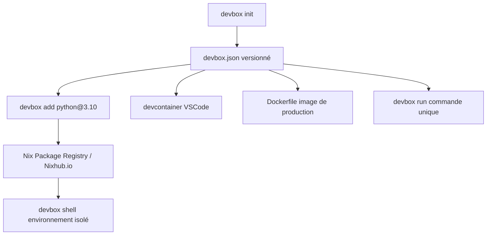

# jetify-com/devbox

> Shells de développement isolés déclarés en JSON, adossés à Nix, pour équipes qui veulent le même outillage.

## Le problème
Installer les dépendances système d'un projet avec `brew` ou `apt-get` pollue la machine et fait diverger les postes de l'équipe.
Deux projets qui réclament deux versions du même binaire deviennent impossibles à faire cohabiter.

## Ce que ça fait vraiment
Un `devbox.json` déclare la liste des paquets ; `devbox shell` ouvre un shell qui les contient, et rien d'autre.
Les paquets viennent du registre Nix (plus de 400 000 versions annoncées), avec épinglage de version de type `python@3.10`.
Les variables d'environnement et la configuration Git de la machine restent accessibles dans le shell.
La même définition sert aussi à produire un devcontainer VSCode, un Dockerfile ou un environnement distant.

## Comment c'est branché


## Essayer
```sh
curl -fsSL https://get.jetify.com/devbox | bash
devbox init
devbox add python@3.10
devbox shell
python --version
devbox help
```

## Coût et pièges
Gratuit, rien à provisionner. L'installation passe par un script `curl | bash`, à lire avant exécution.
Le moteur est `nix` : le premier `devbox add` télécharge le store Nix, donc du disque et de la patience.

## Ce que ce n'est pas
Pas de la virtualisation : le README insiste sur l'absence de couche supplémentaire, ce n'est donc pas un isolement de sécurité.
Pas un gestionnaire de paquets Python ou Node — ça gère le niveau système, en dessous de `yarn` ou `pip`.
Pas indépendant de Nix : tout problème de résolution de paquet remonte à Nix.

## Alternatives
- nix : la couche sous-jacente, remerciée dans le README ; l'utiliser directement si vous acceptez sa courbe d'apprentissage.

## Pour toi
Bon candidat pour figer l'outillage système d'un projet data (Python, CUDA côté hôte exclu) sans salir le poste.
