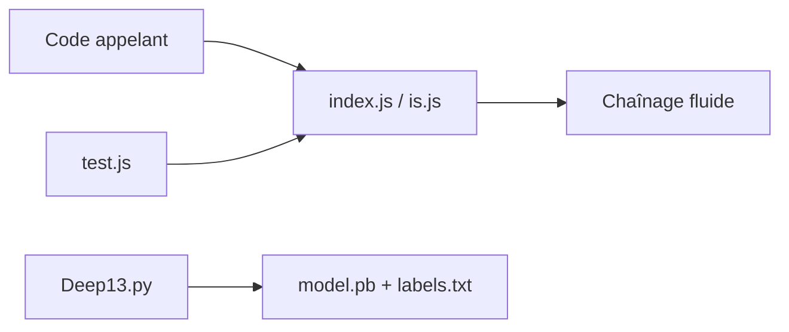

# jezen/is-thirteen

> Paquet npm parodique qui vérifie si un nombre vaut 13, avec syntaxe fluide.

## Le problème
Aucun, c'est une blague : elle parodie les micro-paquets npm de vérification.

## Ce que ça fait vraiment
Expose `is(13).thirteen()` et des chaînages : `roughly`, `within(n).of`, `plus`, `minus`, `times`, `divideby`, `yearOfBirth`. Le dépôt contient aussi un classifieur d'images `Deep13_Image_Classifier` (Python, modèle `model.pb`) et un fichier `Assembler.oldSchool`, non décrits par le README.

## Comment c'est branché


## Essayer
```bash
npm --save i is-thirteen
npm test
```

## Coût et pièges
Gratuit ; aucune licence déclarée. Le README avertit lui-même de lire le code source.

## Ce que ce n'est pas
Pas une dépendance sérieuse pour la production.

## Alternatives
Aucune nommée dans le README.

## Pour toi
À ignorer : humour de développeur, sans usage réel et sans licence.

