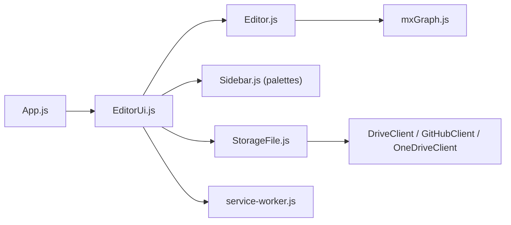

# jgraph/drawio

> Éditeur de diagrammes et de tableaux blancs dans le navigateur, auto-hébergeable, développé par l'équipe draw.io.

## Le problème
Dessiner des schémas d'architecture sans outil propriétaire et sans envoyer ses fichiers à un tiers.

## Ce que ça fait vraiment
Une application web : shell (`App.js`), interface (`EditorUi.js`), moteur de graphe mxGraph avec layout automatique, routage des arêtes et historique d'annulation. Elle gère palettes de formes, import (VSDX), export, et stockage navigateur, Google Drive, Dropbox, GitHub, GitLab et OneDrive. Un service worker assure le cache hors ligne.

## Comment c'est branché

## Essayer
Le README ne donne aucune commande. Trois options : forker le dépôt et publier sur GitHub Pages, utiliser l'image Docker officielle, ou télécharger draw.io Desktop. Des fichiers .war sont dans les releases.

## Coût et pièges
Gratuit. L'équipe n'accepte pas de pull requests. La marque « draw.io » est déposée dans l'UE : ne pas réutiliser nom ni logo sans accord écrit.

## Ce que ce n'est pas
Pas un éditeur SVG (l'export SVG sert à l'embarquement web). Pas de collaboration temps réel dans cette version.

## Alternatives
Aucune alternative nommée dans le README.

## Pour toi
À adopter : outil de schémas d'architecture mûr, auto-hébergeable en Docker, utile pour documenter des pipelines data et ML sans fournisseur externe.

