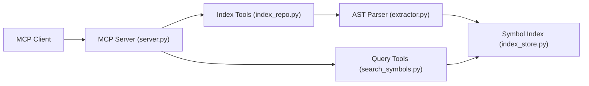

# jgravelle/jcodemunch-mcp

> Serveur MCP qui indexe un dépôt par arbre syntaxique pour que l'agent lise des symboles, pas des fichiers.

## Le problème
Les agents de code relisent des fichiers entiers ; le contexte se gaspille et les jetons coûtent.

## Ce que ça fait vraiment
Indexe le code avec tree-sitter (70+ langages) dans un index local SQLite (`~/.code-index/`). Outils : `search_symbols`, `get_symbol_source`, `find_importers`, `get_blast_radius`, `assemble_task_context`. Sur 3 dépôts publics, l'auteur mesure 28,3× moins de jetons qu'un agent qui lit les fichiers (méthodologie publiée).

## Comment c'est branché


## Essayer
```bash
uv tool install jcodemunch-mcp
jcodemunch-mcp init
claude mcp add -s user jcodemunch -- uvx jcodemunch-mcp
```

## Coût et pièges
Gratuit pour l'usage non commercial ; usage commercial payant (de 79 à 1 999 $ selon l'offre). Compteur d'économies anonyme par défaut (désactivable). Licence propre (« Dual-Use »), non reconnue par GitHub.

## Ce que ce n'est pas
Pas open source au sens usuel : interdit de renommer ou publier sur un registre. Aucun gain quand il faut lire tout le fichier. Chiffres marketing auto-déclarés.

## Alternatives
Aucune alternative nommée dans le README.

## Pour toi
À surveiller : gain de jetons plausible et méthodologie publiée, mais licence à clauses commerciales à faire valider avant tout usage professionnel.
