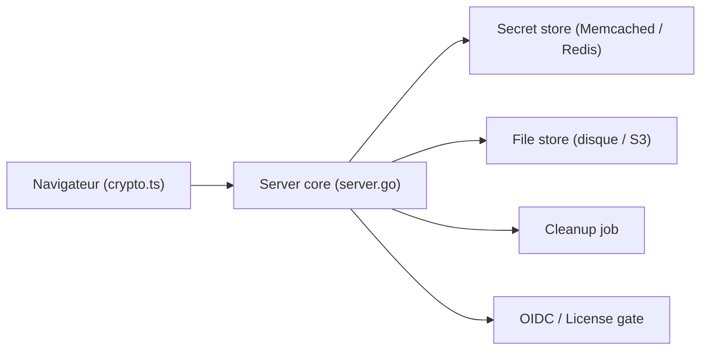

# jhaals/yopass

> Service auto-hébergé pour partager mots de passe et fichiers, chiffrés dans le navigateur.

## Le problème
Envoyer des identifiants par e-mail ou messagerie laisse du texte en clair dans les historiques.

## Ce que ça fait vraiment
Le navigateur chiffre le secret en OpenPGP avec une clé aléatoire. Le serveur ne stocke que le chiffré, avec expiration. Le lien contient la clé dans son fragment d'URL, jamais envoyé au serveur. Un secret à usage unique est supprimé après lecture. Le stockage passe par Memcached ou Redis, et les fichiers par disque ou S3.

## Comment c'est branché


## Essayer
```bash
docker network create yopass
docker run -d --name yopass-memcached --network yopass memcached
docker run -d --name yopass --network yopass \
  -p 127.0.0.1:1337:1337 \
  jhaals/yopass --memcached=yopass-memcached:11211
```

## Coût et pièges
Édition libre gratuite. Une licence commerciale débloque OIDC, thèmes, audit et fichiers de plus de 1 Mo. HTTPS obligatoire en production.

## Ce que ce n'est pas
Pas un gestionnaire de mots de passe. Sans TLS, la confidentialité n'est pas garantie. L'instance de démonstration publique est pour tester seulement.

## Alternatives
Aucune alternative nommée dans le README.

## Pour toi
À adopter pour partager clés d'API et jetons en équipe sans les laisser dans Slack : déploiement simple, maintenu depuis 2014.

