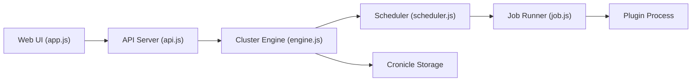

# jhuckaby/Cronicle

> Planificateur de tâches multi-serveurs avec interface web, remplaçant enrichi de cron, écrit en Node.js.

## Le problème
Cron ne donne ni vue centralisée, ni journaux en direct, ni bascule sur un serveur de secours.

## Ce que ça fait vraiment
Un serveur primaire tient l'horloge et affecte les jobs aux serveurs de travail (groupes, bascule automatique, découverte). Les jobs sont des commandes shell ou des plugins dans n'importe quel langage, échangeant du JSON. Interface web avec journal en direct, statistiques CPU et mémoire, fuseaux horaires, file d'attente, webhooks, API REST et clés d'API.

## Comment c'est branché


## Essayer
```bash
# Aucune commande documentée dans ce README : l'installation renvoie
# à la page « Installation & Setup » de la documentation (liens non repris ici).
```

## Coût et pièges
Gratuit. Modules listés en dépendance (MIT, BSD, OFL) ; la licence du dépôt lui-même est « présente mais non identifiée » : à lire avant usage. Le README annonce que xyOps est le successeur et que Cronicle ne reçoit plus que des correctifs de bugs et de sécurité.

## Ce que ce n'est pas
Pas un orchestrateur de workflows avec dépendances entre tâches : le README décrit des événements planifiés et des jobs. Pas un projet en développement de fonctionnalités.

## Alternatives
xyOps (pixlcore/xyops) : successeur annoncé par l'auteur, à préférer pour un nouveau projet.

## Pour toi
À surveiller : pratique pour des jobs planifiés (ré-entraînement, exports) sur quelques machines, mais en mode maintenance ; regarde xyOps avant de t'engager.

