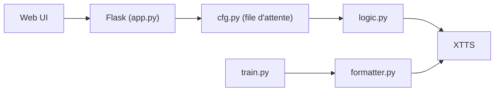

# jianchang512/clone-voice

> Outil web local de clonage de voix (XTTS v2), texte vers voix ou voix vers voix, 16 langues.

## Le problème
Synthétiser un texte avec une voix de référence sans GPU ni service cloud.

## Ce que ça fait vraiment
Interface web Flask sur 127.0.0.1:9988. Texte→voix (import SRT possible) et voix→voix à partir d'un échantillon de 5 à 20 s (fichier ou micro). CUDA utilisé si disponible. Un écran d'entraînement affine XTTS (transcription Whisper, `train.py`). Version Windows précompilée (1,7 Go + 3 Go de modèle).

## Comment c'est branché


## Essayer
```bash
python -m venv venv
pip install -r requirements.txt --no-deps
python code_dev.py
python app.py
```

## Coût et pièges
Gratuit. Source : Python 3.9–3.11, ffmpeg, proxy stable pour télécharger les modèles, et modification manuelle de bibliothèques tierces selon le README.

## Ce que ce n'est pas
Modèle XTTS sous licence Coqui Public Model License : recherche uniquement, pas d'usage commercial. Dépôt archivé. Qualité chinoise « correcte » d'après l'auteur.

## Alternatives
Aucune nommée (projets liés du même auteur : traduction vidéo, reconnaissance vocale).

## Pour toi
À ignorer : archivé, licence du modèle non commerciale et installation fragile ; cherche un TTS maintenu.

