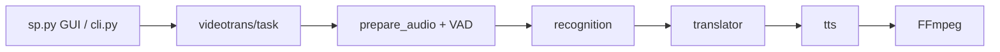

# jianchang512/pyvideotrans

> Outil de traduction et de doublage automatique de vidéos, du sous-titrage à la synthèse vocale.

## Le problème
Traduire une vidéo demande d'enchaîner à la main transcription, traduction, voix de synthèse et remontage.

## Ce que ça fait vraiment
Chaîne complète : reconnaissance vocale (Faster-Whisper local ou API), traduction (LLM ou services classiques, Ollama en local), synthèse vocale multi-rôles avec clonage (F5-TTS, CosyVoice, GPT-SoVITS), puis recomposition par FFmpeg. Interfaces Qt, CLI, WebUI et Docker ; pause et correction manuelle à chaque étape. Le code est organisé en adaptateurs interchangeables pour ASR, traduction et TTS.

## Comment c'est branché


## Essayer
```bash
git clone https://github.com/jianchang512/pyvideotrans.git
cd pyvideotrans
uv sync
uv run sp.py
uv run cli.py --task stt --name "./audio.wav" --model_name large-v3
```

## Coût et pièges
FFmpeg obligatoire ; GPU NVIDIA recommandé (CUDA 12.8, cuDNN 9.11). Les API tierces (OpenAI, Azure, etc.) sont à ta charge. Le README dégage toute responsabilité sur le contenu protégé traité.

## Ce que ce n'est pas
Ce n'est pas un modèle : c'est un orchestrateur de modèles et d'API existants. Qualité du doublage variable.

## Alternatives
Le README ne cite pas d'alternative directe.

## Pour toi
À surveiller : bon banc d'essai pour enchaîner ASR, LLM et TTS localement, mais lourd à installer et dépendant de nombreuses clés.

