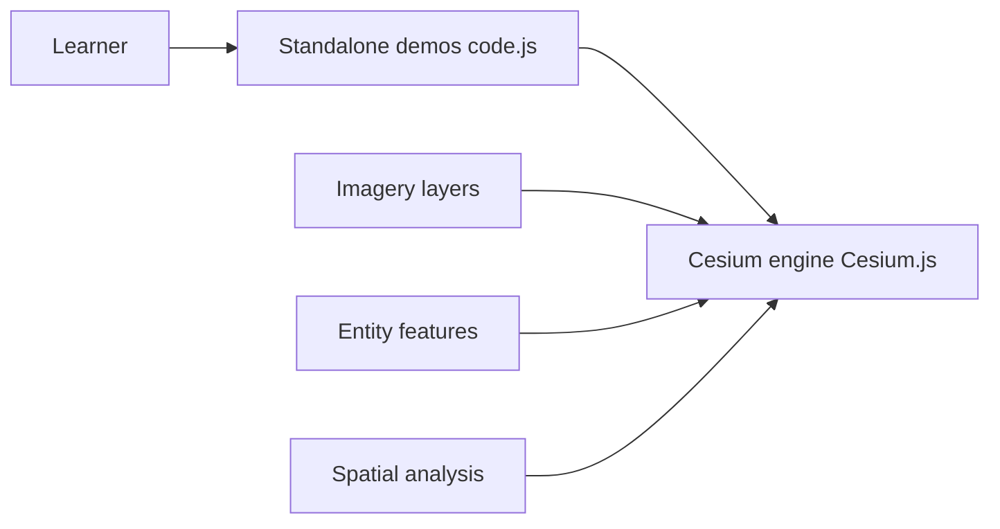

# jiawanlong/Cesium-Examples

> Collection de démos Cesium natives pour apprendre la cartographie 3D web, avec analyse spatiale.

## Le problème
Les débutants en Cesium manquent d'exemples complets et sans surcouche pour prototyper une carte 3D.

## Ce que ça fait vraiment
Des démos autonomes (un fichier par exemple) : imagerie (xyz, wms, wmts), vecteurs (shp, geojson, mvt), terrain, entités et primitives, modèles glb/3D Tiles, analyses (visibilité, inondation, coupes), fusion vidéo, effets, particules, physique, visualisations (vents, chaleur, courants). À servir via un serveur web comme nginx.

## Comment c'est branché


## Essayer
```bash
# Aucune commande : copier le projet complet sous nginx (ou autre conteneur web),
# ou ouvrir https://jiawanlong.github.io/Cesium-Examples/
```

## Coût et pièges
Gratuit. Aucune licence : droit de réutilisation du code non défini, malgré la mention « gratuit, pas d'autorisation requise » du README. Documentation en chinois.

## Ce que ce n'est pas
Pas une bibliothèque : des exemples. Le diagramme d'architecture n'a pas pu inspecter les démos, seulement le moteur Cesium embarqué.

## Alternatives
Superdéfinir mars3d et SuperMap (cités comme concurrents plus lourds).

## Pour toi
À ignorer : utile seulement si tu fais de la géovisualisation 3D, et l'absence de licence rend la réutilisation risquée.

