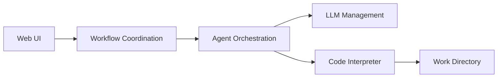

# jihe520/MathModelAgent

> Agents et skills qui rédigent automatiquement un mémoire de concours de modélisation mathématique.

## Le problème
Un concours de modélisation (CUMCM, MCM/ICM) exige en trois jours analyse, code, figures et article mis en page.

## Ce que ça fait vraiment
Version historique : agents modélisateur, codeur (interpréteur Jupyter local ou E2B/Daytona) et rédacteur, un modèle par agent via LiteLLM.
Web UI + backend FastAPI + Redis ; options web search (Tavily), RAG (ChromaDB), humain dans la boucle.
Nouvelle orientation : un jeu de skills pour Claude Code ou Codex (`/1start-mathmodel`), 17 modèles Typst, 9 étapes de vérification.
Version bureau prête à l'emploi.

## Comment c'est branché


## Essayer
```bash
npx skills add jihe520/MathModelAgent --all
git clone https://github.com/jihe520/MathModelAgent.git
docker-compose up
```

## Coût et pièges
Clé LLM à ta charge ; le mode skills se lance avec `--dangerously-skip-permissions` / `--yolo`, donc sans garde-fou.

## Ce que ce n'est pas
Pas capable de gagner un concours selon l'auteur lui-même ; projet de démo expérimental, sans licence, README en chinois.

## Alternatives
Aucune alternative nommée (Agent Laboratory, TaskWeaver cités comme références, pas comme alternatives).

## Pour toi
À surveiller : l'architecture skills + modèles Typst + vérification automatique est un bon cas d'étude pour générer des rapports, pas un outil à déployer.
