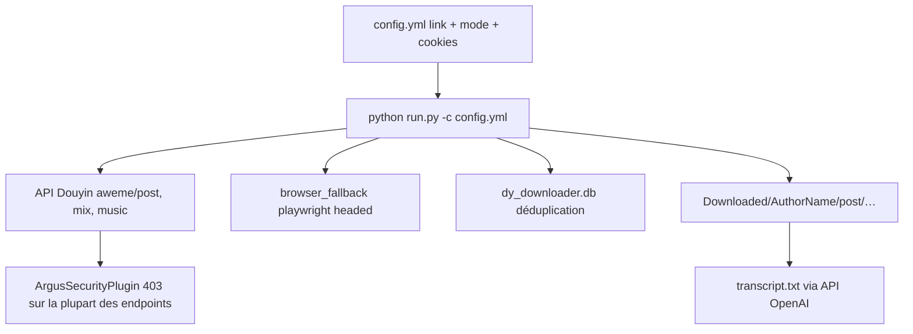

# jiji262/douyin-downloader

> Téléchargeur en ligne de commande pour Douyin, avec base SQLite de déduplication et reprise.

## Le problème
Archiver les publications d'un compte Douyin à la main est impraticable, et les téléchargements se dupliquent d'un passage à l'autre.
Les interfaces changent, donc un script maison casse sans avertissement.

## Ce que ça fait vraiment
Télécharge vidéos, notes images, collections, musiques, favoris et publications de profil, piloté par un `config.yml` et des options CLI.
Déduplication SQLite plus vérification des fichiers sur disque, reprise incrémentale par mode (`increase.post`), filtres de date, concurrence et retries.
Extras : collecte de commentaires en JSON, enregistrement de live en FLV, `--hot-board` et `--search` en JSONL, serveur REST `--serve` (FastAPI), notifications Bark/Telegram/webhook.
Transcription facultative des vidéos via une API compatible OpenAI (`gpt-4o-mini-transcribe`).

## Comment c'est branché


## Essayer
```bash
pip install -r requirements.txt
pip install playwright
python -m playwright install chromium
cp config.example.yml config.yml
python -m tools.cookie_fetcher --config config.yml
python run.py -c config.yml
python run.py --hot-board 30 -p ./Downloaded
python run.py --serve --serve-port 8000
python3 -m pytest -q
```

## Coût et pièges
Le README annonce lui-même que la porte anti-robot de Douyin renvoie 403 sur les vidéos seules, collections, musiques, likes et favoris depuis août-septembre 2026 : la signature `x-secsdk-web-signature` ne peut être produite que dans une vraie page web.
Reste le fallback navigateur pour les publications de profil, non testé contre cette porte. Cookies d'un compte connecté requis ; transcription = clé OpenAI à votre charge.

## Ce que ce n'est pas
Pas un outil fonctionnel en CLI aujourd'hui pour l'essentiel de ses modes — l'auteur renvoie vers son application de bureau Douzy, en bêta fermée.
Pas un enregistreur de live abouti : le HLS ne sauve que la playlist, l'endpoint webcast est déclaré expérimental.
Pas sans risque juridique : le README rappelle que l'usage et ses conséquences sont à votre charge.

## Alternatives
Aucun dépôt alternatif nommé dans le README.

## Pour toi
À écarter : hors sujet pour un profil data, et la moitié des fonctions sont bloquées côté plateforme.
