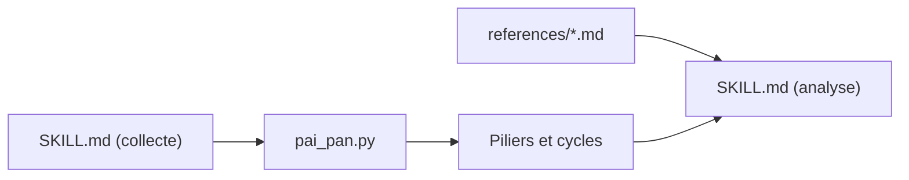

# jinchenma94/bazi-skill

> Skill Claude Code qui calcule un thème de naissance chinois (Bazi) et le commente d'après neuf classiques.

## Le problème
Calculer les quatre piliers, les grands cycles et leur lecture demande des tables et des règles de calendrier.

## Ce que ça fait vraiment
Le skill recueille nom, date, heure, sexe et lieu, appelle `scripts/pai_pan.py` (Python standard, sans dépendance) pour établir les piliers et les cycles, puis rédige une analyse (force du maître du jour, éléments, cycles). Le contenu de `SKILL.md` n'a pas été lu en détail. Le README est en chinois.

## Comment c'est branché


## Essayer
```bash
mkdir -p .claude/skills
git clone https://github.com/jinchenma94/bazi-skill .claude/skills/bazi
python3 scripts/pai_pan.py --solar 1990-05-15 --shichen 午 --sex 男
```

## Coût et pièges
Gratuit ; python3 3.6+. Date et heure de naissance saisies dans la conversation, donc confiées au modèle.

## Ce que ce n'est pas
Divertissement : le README précise que l'analyse ne fonde aucune décision.

## Alternatives
Aucune citée dans le README.

## Pour toi
Curiosité culturelle, sans valeur pour un travail data/IA : ignorer.

