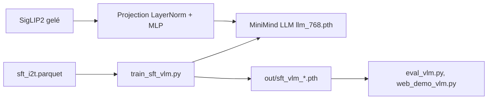

# jingyaogong/minimind-v

> Code complet pour entraîner de zéro un petit modèle vision-langage de 65M de paramètres, en tutoriel.

## Le problème
Comprendre comment se construit un VLM sans partir d'un modèle de plusieurs milliards de paramètres, ni d'un coût d'entraînement hors de portée.

## Ce que ça fait vraiment
Encodeur visuel SigLIP2 gelé, projection (LayerNorm et MLP à deux couches) vers 64 jetons visuels, puis un petit LLM MiniMind dont seules la projection et les couches extrêmes sont entraînées. Le dépôt fournit structure, nettoyage des données, pré-entraînement optionnel et SFT (ALLaVA-4V, environ 2,9 millions d'échantillons). Le « 65M » ne compte pas l'encodeur (~95M gelés) : le modèle complet approche 160M. Le README juge lui-même le résultat « compréhension du sens général, détails imprécis ».

## Comment c'est branché


## Essayer
```bash
git clone --depth 1 https://github.com/jingyaogong/minimind-v
pip install -r requirements.txt -i https://pypi.tuna.tsinghua.edu.cn/simple
modelscope download --model gongjy/siglip2-base-p32-256-ve --local_dir ./model/siglip2-base-p32-256-ve
modelscope download --model gongjy/minimind-3v-pytorch llm_768.pth --local_dir ./out
python train_sft_vlm.py --epochs 2 --from_weight llm
python eval_vlm.py --load_from model --weight sft_vlm
```

## Coût et pièges
Environ 2 h sur une RTX 3090 et 3 CNY de location GPU pour un epoch de SFT (chiffres de l'auteur). Le LLM de base n'est pas entraîné de zéro. Le schéma généré cite CLIP et une projection linéaire, contredits par le README (SigLIP2, MLP) : suivre le README.

## Ce que ce n'est pas
Ce n'est pas un VLM utilisable en production : hallucinations et répétitions reconnues. « De zéro » vaut pour la partie VLM, pas pour le langage.

## Alternatives
LLaVA et Qwen-VL sont cités comme modèles comparables ; MiniMind-O pour l'omni-modal.

## Pour toi
Adopter comme support d'apprentissage : un VLM lisible de bout en bout que l'on peut entraîner sur une carte grand public, en gardant en tête qu'il ne sert pas de brique de production.

