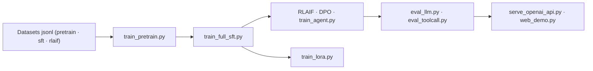

# jingyaogong/minimind

> Entraîner un LLM de 64M de zéro en ~2 h sur une seule carte, code et données ouverts.

## Le problème
Les frameworks (`transformers`, `trl`, `peft`) exposent des interfaces si abstraites qu'on ne voit plus ce que fait le modèle ; et un modèle de plusieurs dizaines de milliards est hors de portée d'une machine personnelle.

## Ce que ça fait vraiment
Fournit la structure complète d'un LLM (Dense + MoE) alignée sur l'écosystème Qwen3, plus toute la chaîne d'entraînement écrite en PyTorch natif, sans abstraction tierce : pretrain, SFT, LoRA, RLHF-DPO, RLAIF (PPO/GRPO/CISPO), Tool Use, Agentic RL, thinking adaptatif, distillation boîte blanche et noire. Tokenizer maison à 6 400 entrées. Sert via une API compatible OpenAI et une WebUI Streamlit ; compatible llama.cpp, vLLM, Ollama. Datasets publiés sur ModelScope et HuggingFace.

## Comment c'est branché


## Essayer
```bash
git clone --depth 1 https://github.com/jingyaogong/minimind
cd minimind && pip install -r requirements.txt
cd trainer && python train_pretrain.py
cd trainer && python train_full_sft.py
python eval_llm.py --weight full_sft
```

## Coût et pièges
Apache 2.0, gratuit. Le coût annoncé (~3 ¥, ~2 h) correspond à une époque SFT sur une 3090 louée à ~1,3 ¥/h. Les datasets complets pèsent lourd : 10 Go pour `pretrain_t2t.jsonl`, 14 Go pour `sft_t2t.jsonl` ; les variantes `mini` (1,2 et 1,6 Go) suffisent à reproduire. Documentation en chinois.

## Ce que ce n'est pas
Ce n'est pas un modèle utile en production : les connaissances factuelles et la généralisation restent très limitées, et le Tool Call ne couvre qu'une dizaine d'outils simulés. Combiner tool call et thinking explicite ne fonctionne pas encore de façon stable, faute de données jointes.

## Alternatives
- Llama-Factory, TRL, peft : cités comme compatibles, si tu veux entraîner sans réimplémenter.
- MiniMind-V / -O / -dLM / -Linear : les déclinaisons multimodales et expérimentales.

## Pour toi
À adopter comme support d'apprentissage : la meilleure manière de comprendre réellement ce que fait `trainer.train()`.
