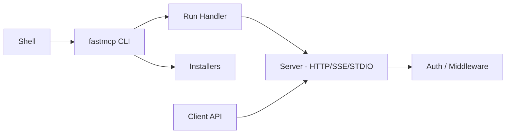

# jlowin/fastmcp

> Framework Python pour écrire serveurs, clients et applications MCP à partir de simples fonctions.

## Le problème
Écrire un serveur MCP à la main oblige à gérer schémas, validation, transports et authentification.

## Ce que ça fait vraiment
Un décorateur `@mcp.tool` transforme une fonction Python en outil MCP, avec schéma et documentation générés. Trois piliers : serveurs (outils, ressources, prompts), clients (négociation de transport, authentification) et applications à interface interactive. Une CLI `fastmcp` lance un serveur et installe des intégrations (Claude Code, Claude Desktop, Cursor, mcp.json). Le README affirme être présent derrière 70 % des serveurs MCP ; chiffre non vérifié.

## Comment c'est branché


## Essayer
```bash
uv add fastmcp
```
```python
from fastmcp import FastMCP
mcp = FastMCP("Demo 🚀")

@mcp.tool
def add(a: int, b: int) -> int:
    return a + b

if __name__ == "__main__":
    mcp.run()
```

## Coût et pièges
Gratuit. Le README oriente vers Prefect Horizon (passerelle d'entreprise, offre du même éditeur) pour le déploiement à l'échelle. Des guides de migration existent depuis FastMCP 2/3 et le SDK MCP.

## Ce que ce n'est pas
Pas un client LLM ni un agent : il expose ou consomme des outils MCP. Le composant Horizon est une offre séparée.

## Alternatives
Le SDK Python MCP officiel (dans lequel FastMCP 1.0 a été intégré) ; `@prefecthq/fastmcp-ts` pour TypeScript.

## Pour toi
À adopter : c'est la voie courte pour exposer tes fonctions ou pipelines data à un agent via MCP, avec un éditeur qui maintient activement le projet.
