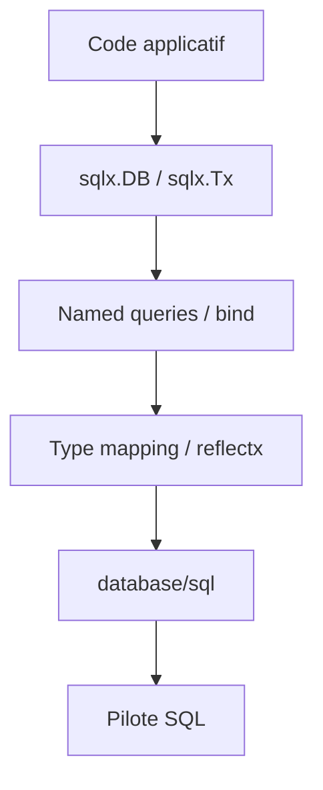

# jmoiron/sqlx

> Extensions Go de `database/sql` pour mapper les lignes SQL vers des structs.

## Le problème
Avec `database/sql`, chaque colonne se scanne à la main et les paramètres nommés n'existent pas. Le code devient vite verbeux.

## Ce que ça fait vraiment
Il ajoute `sqlx.DB`, `Tx` et `Stmt`, qui englobent les types standard sans en changer l'interface.
Les lignes sont chargées dans des structs, des maps ou des slices. `Get` et `Select` vont directement de la requête au résultat.
Il accepte les paramètres nommés (`:name`), les insertions en lot et `BindDriver` pour les pilotes inconnus.

## Comment c'est branché


## Essayer
```bash
go get github.com/jmoiron/sqlx
```

## Coût et pièges
C'est gratuit. Avec des en-têtes de colonnes ambigus (`SELECT a.id, b.id`), il faut des alias `AS`.

## Ce que ce n'est pas
Ce n'est pas un ORM : pas de migrations, pas de génération de requêtes. Le code est en Go, pas en Python. Le dernier push date du 2024-08-15.

## Alternatives
Le README ne nomme aucun dépôt alternatif.

## Pour toi
À ignorer : une brique Go stable, mais hors de ton écosystème Python/ML et quasi à l'arrêt.
