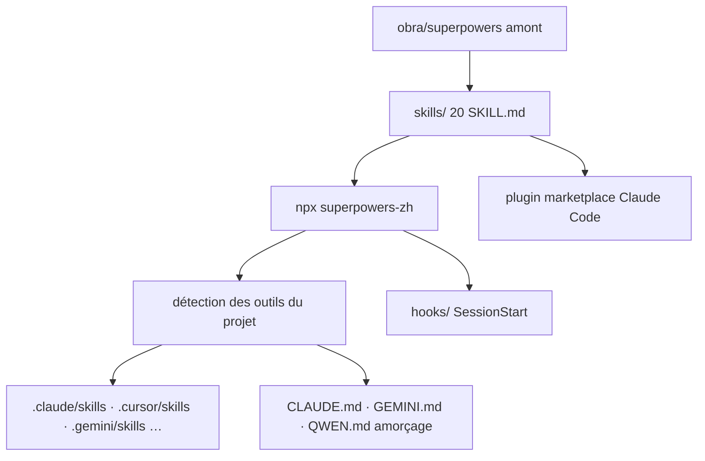

# jnMetaCode/superpowers-zh

> **Chinese fork of the obra/superpowers skill set, installable in one command onto 26 coding agents.**

## The problem

The working methods of a coding agent — frame before writing, TDD, ordered debugging,
review — live in `SKILL.md` files that each tool looks for in a different directory:
`.claude/skills/`, `.cursor/skills/`, `.gemini/skills/`, `.github/superpowers/`, and so on.
Upstream `obra/superpowers` covers six tools only, in English, each with its own marketplace
command. Laying the same baseline across a mixed toolset therefore becomes a series of manual
copies.

## What it actually does

The repository holds 20 skills: 14 translated from upstream, 4 written for the Chinese context
(`chinese-code-review`, `chinese-git-workflow`, `chinese-documentation`,
`chinese-commit-conventions`, all manually invoked via `/chinese-xxx`), and 2 kept from
upstream after being removed there (`mcp-builder`, `workflow-runner`). The translated set
covers `brainstorming`, `writing-plans`, `executing-plans`, `test-driven-development`,
`systematic-debugging`, `requesting-code-review`, `receiving-code-review`,
`verification-before-completion`, `dispatching-parallel-agents`,
`subagent-driven-development`, `using-git-worktrees`, `finishing-a-development-branch`,
`writing-skills`, `using-superpowers`. The fork's own contribution is the installer:
`npx superpowers-zh` detects the tools present in the project, copies the skills to the right
place, generates the bootstrap files (`CLAUDE.md`, `HERMES.md`, `GEMINI.md`, `QWEN.md`…),
configures a `SessionStart` hook and applies per-tool adaptations. The README claims 26
targets, among them Claude Code, Cursor, Codex, Gemini CLI, Windsurf, Kiro, Aider, Cline,
Crush, CodeBuddy, CodeArts, ZCode, DeepSeek Harness and Reasonix. Additions to the upstream
text are limited to two explicitly labelled sections, and an `audit` fails any unlabelled one.

## How it is wired

No code-derived diagram exists for this repository; the graph below is reconstructed from the
README.



Three install paths coexist: `npx superpowers-zh` per project or with `--global`, the Claude
Code plugin marketplace for that tool alone, and a manual `cp -r skills`. The README calls the
last one low-fidelity: it moves the files but neither the hooks nor the bootstrap, so the
skills stop triggering on their own. Per-tool guides sit in `docs/README.<tool>.md`.

## Try it

```bash
cd /your/project
npx superpowers-zh
```

Global install, shared by every project:

```bash
npx superpowers-zh --global --tool claude
```

Through the Claude Code marketplace:

```bash
claude plugin marketplace add jnMetaCode/superpowers-zh
claude plugin install superpowers-zh@superpowers-zh
```

Removal: `npx superpowers-zh@latest --uninstall`.

## Cost and traps

MIT licence, no payment, no key. The traps are elsewhere. The README is in Chinese and so are
the skills: that is this fork's writing language, not a cosmetic detail, and it is what the
agent will read. A project-level install run from `~` was destructive before v1.2.1 — it wrote
skills and `CLAUDE.md` into the home directory; it is now refused. v1.7.12 fixes a bug where
every cross-skill call failed in plugin mode, upstream's `superpowers:` prefix not matching
the `superpowers-zh` name: anyone who installed via the marketplace before that version must
update. Other recent fixes concern wrong Windows paths and an install into
`C:\Windows\System32` from an administrator PowerShell. Finally, the README is heavily
sponsored: API-reseller banners with affiliate links and promo codes, plus pointers to the
author's courses. That is commercial content mixed into the documentation, and should be read
as such.

## What it is not

These are not domain skills: the repository teaches no framework and no language, only ways of
running a task. Nor is it an independent project: the baseline stays `obra/superpowers`,
tracked and retranslated here. The 26-tool figure names documented install paths, not a
guarantee of automatic triggering everywhere — without hooks, several targets require calling
the skill by hand. And it is not language-neutral: the content is Chinese.

## Alternatives

Upstream `obra/superpowers` is the direct alternative: the same 14 skills, in English, six
tools, per-tool installation. The README also cites repositories by the same author that
complement rather than replace it — `agency-agents-zh` for expert roles,
`agency-orchestrator` to orchestrate them, `ai-coding-guide` for the tutorial. Among the
catalogue neighbours, `NVIDIA/SkillSpector` also touches agent skills but from the inspection
side, and `liyupi/ai-guide` remains a reading guide, not an installable baseline.

## For you

Mostly useful as a source of ideas: the 14 upstream skills are readable in one place, and the
multi-tool installer is the genuinely original part to look at if you want to lay a skill
baseline across several agents. The barrier is language — skills and README in Chinese — which
makes the upstream version more practical for direct use. Worth watching for the install
mechanics, not adopting as is.
