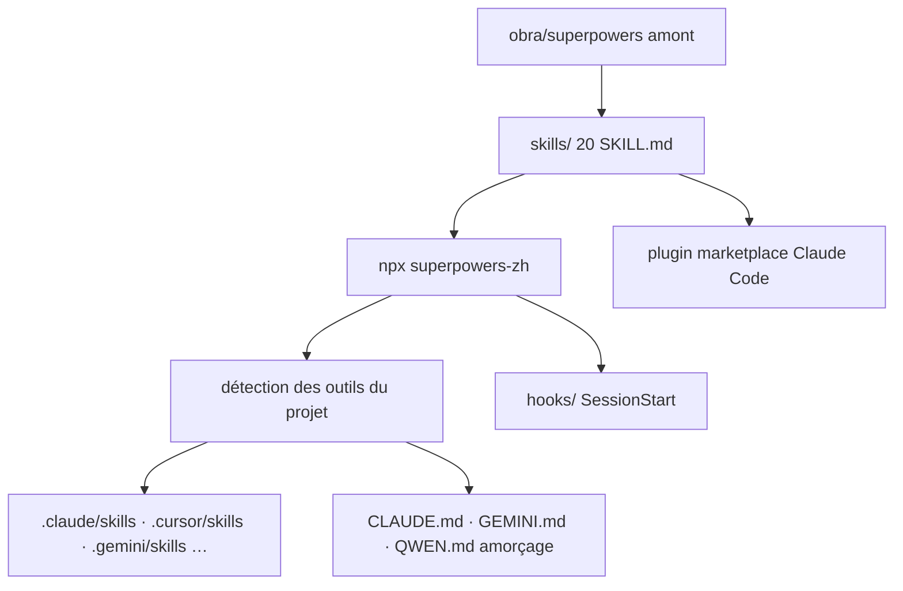

# jnMetaCode/superpowers-zh

> **Fork chinois du jeu de skills obra/superpowers, installable en une commande sur 26 agents de code.**

## Le problème

Les méthodologies de travail d'un agent de code — cadrer avant d'écrire, TDD, débogage
ordonné, revue — vivent dans des fichiers `SKILL.md` que chaque outil va chercher dans un
répertoire différent : `.claude/skills/`, `.cursor/skills/`, `.gemini/skills/`,
`.github/superpowers/`, et ainsi de suite. L'amont `obra/superpowers` ne couvre que six
outils, en anglais, chacun avec sa propre commande de marketplace. Poser le même socle sur
un parc d'outils hétérogène devient donc une série de copies manuelles.

## Ce que ça fait vraiment

Le dépôt contient 20 skills : 14 traduits de l'amont, 4 écrits pour le contexte chinois
(`chinese-code-review`, `chinese-git-workflow`, `chinese-documentation`,
`chinese-commit-conventions`, tous à appel manuel via `/chinese-xxx`), et 2 repris de
l'amont après leur retrait là-bas (`mcp-builder`, `workflow-runner`). Les skills traduits
couvrent `brainstorming`, `writing-plans`, `executing-plans`,
`test-driven-development`, `systematic-debugging`, `requesting-code-review`,
`receiving-code-review`, `verification-before-completion`, `dispatching-parallel-agents`,
`subagent-driven-development`, `using-git-worktrees`, `finishing-a-development-branch`,
`writing-skills`, `using-superpowers`. L'apport propre au fork est l'installeur :
`npx superpowers-zh` détecte les outils présents dans le projet et copie les skills au bon
endroit, génère les fichiers d'amorçage (`CLAUDE.md`, `HERMES.md`, `GEMINI.md`,
`QWEN.md`…), configure un hook `SessionStart` et applique les adaptations par outil. Le
README revendique 26 cibles, dont Claude Code, Cursor, Codex, Gemini CLI, Windsurf, Kiro,
Aider, Cline, Crush, CodeBuddy, CodeArts, ZCode, DeepSeek Harness et Reasonix. Les
incréments par rapport au texte amont sont limités à deux sections, explicitement
étiquetées, et un `audit` fait échouer tout ajout non étiqueté.

## Comment c'est branché

Aucun diagramme tiré du code n'existe pour ce dépôt ; le schéma ci-dessous est reconstruit
depuis le README.



Trois voies de pose coexistent : `npx superpowers-zh` en projet ou en `--global`, le
marketplace de plugins pour Claude Code seul, et une copie manuelle `cp -r skills`. Le
README qualifie cette dernière de « low-fidelity » : elle déplace les fichiers mais ni les
hooks ni l'amorçage, donc les skills ne se déclenchent plus tout seuls. Les guides par
outil sont dans `docs/README.<outil>.md`.

## Essayer

```bash
cd /your/project
npx superpowers-zh
```

Installation globale, partagée par tous les projets :

```bash
npx superpowers-zh --global --tool claude
```

Par le marketplace de Claude Code :

```bash
claude plugin marketplace add jnMetaCode/superpowers-zh
claude plugin install superpowers-zh@superpowers-zh
```

Désinstallation : `npx superpowers-zh@latest --uninstall`.

## Coût et pièges

Licence MIT, aucun paiement, aucune clé. Les pièges sont ailleurs. Le README est en chinois
et les skills aussi : c'est la langue d'écriture de ce fork, pas un détail cosmétique, et
c'est ce que l'agent lira. L'installation projet lancée depuis `~` était destructrice avant
la v1.2.1 — elle écrivait skills et `CLAUDE.md` dans le répertoire personnel ; depuis, elle
est refusée. La v1.7.12 corrige un bug où tout appel croisé entre skills échouait en mode
plugin, le préfixe `superpowers:` de l'amont ne correspondant pas au nom `superpowers-zh` :
qui a installé par le marketplace avant cette version doit mettre à jour. Les autres
correctifs récents concernent des chemins Windows erronés et une pose dans
`C:\Windows\System32` depuis un PowerShell administrateur. Enfin, le README est
lourdement sponsorisé : bandeaux de revendeurs d'API avec liens d'affiliation et codes
promo, plus le renvoi vers des cours de l'auteur. C'est du contenu commercial mêlé à la
documentation, à lire comme tel.

## Ce que ce n'est pas

Ce ne sont pas des skills d'un domaine technique : le dépôt n'enseigne ni framework ni
langage, seulement des manières de conduire une tâche. Ce n'est pas non plus un projet
indépendant : le socle reste `obra/superpowers`, suivi et retraduit ici. Le chiffre de 26
outils désigne des chemins d'installation documentés, pas une garantie de déclenchement
automatique partout — sans hooks, plusieurs cibles exigent d'appeler le skill à la main. Et
ce n'est pas un outil neutre de langue : le contenu est en chinois.

## Alternatives

L'amont `obra/superpowers` reste l'alternative directe : mêmes 14 skills, en anglais, six
outils, installation par outil. Le README cite aussi des dépôts du même auteur qui
complètent plutôt qu'ils ne remplacent — `agency-agents-zh` pour des rôles d'experts,
`agency-orchestrator` pour leur orchestration, `ai-coding-guide` pour le tutoriel.
Parmi les voisins du catalogue, `NVIDIA/SkillSpector` touche aussi aux skills d'agents mais
côté inspection, et `liyupi/ai-guide` reste un guide de lecture, pas un socle installable.

## Pour toi

Utile surtout comme source d'inspiration : les 14 skills amont y sont lisibles d'un bloc, et
l'installeur multi-outils est la partie réellement originale à regarder si tu veux poser un
socle de skills sur plusieurs agents. La barrière est la langue — skills et README en
chinois — qui rend la version amont plus pratique à l'usage direct. À surveiller pour la
mécanique d'installation, pas à adopter tel quel.
