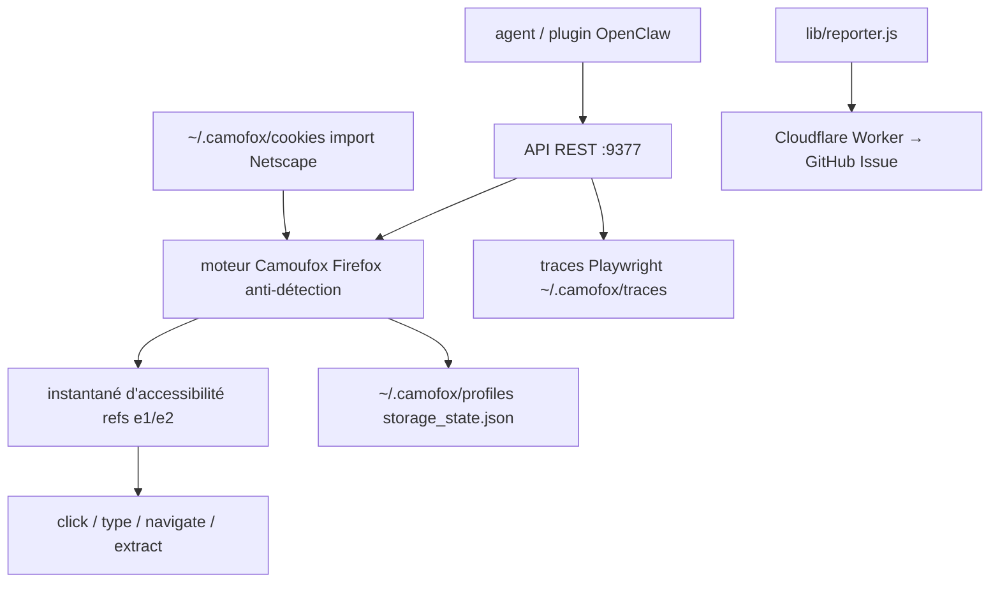

# jo-inc/camofox-browser

> API REST de navigation pour agents, adossée à Camoufox, avec instantanés d'accessibilité et refs stables.

## Le problème
Un agent qui doit naviguer sur le web réel se fait bloquer : Playwright est détecté, Chrome headless est empreinté, et les greffons de furtivité deviennent eux-mêmes la signature.
Envoyer le HTML brut au modèle coûte une fortune en tokens.

## Ce que ça fait vraiment
Expose Camoufox — un Firefox dont les empreintes sont truquées au niveau C++ (`navigator.hardwareConcurrency`, WebGL, AudioContext, géométrie d'écran, WebRTC) — derrière une API REST pensée pour les agents.
Renvoie des instantanés d'accessibilité annoncés environ 90 % plus petits que le HTML, avec des refs stables `e1`, `e2` pour cliquer et taper ; pagination par `offset` sur les grandes pages.
Sessions isolées par utilisateur, persistance des cookies et du localStorage dans `~/.camofox/profiles/`, import de cookies Netscape, proxy avec GeoIP (locale, fuseau, géolocalisation alignés sur l'IP de sortie), sessions collantes en mode backconnect.
Extras : transcripts YouTube via yt-dlp, macros de recherche (`@google_search`…), extraction structurée par JSON Schema avec `x-ref`, traces Playwright par session, logs JSON, doc OpenAPI sur `/docs`.

## Comment c'est branché


## Essayer
```bash
git clone https://github.com/jo-inc/camofox-browser && cd camofox-browser
npm install && npm start
npx @askjo/camofox-browser
openclaw plugins install @askjo/camofox-browser
make up
make fetch
docker run -p 9377:9377 -e CAMOFOX_API_KEY="your-generated-key" -v ~/.camofox/cookies:/home/node/.camofox/cookies:ro camofox-browser
openssl rand -hex 32
export CAMOFOX_CRASH_REPORT_ENABLED=false
```

## Coût et pièges
Gratuit ; premier démarrage télécharge Camoufox (~300 Mo) et l'empreinte mémoire au repos est annoncée à ~40 Mo.
Télémétrie de plantage activée par défaut, qui ouvre des issues GitHub automatiquement, avec anonymisation décrite et vérification par hash de l'endpoint ; `CAMOFOX_CRASH_REPORT_ENABLED=false` la coupe. Ne pas lancer `docker build` directement : passer par `make up`. Sans `CAMOFOX_API_KEY`, l'import de cookies est refusé en 403.

## Ce que ce n'est pas
Pas un navigateur pour humains : la sortie est un arbre d'accessibilité, pas une page rendue.
Pas Chromium : les fonctions Playwright réservées à Chromium, comme `recordVideo`, n'existent pas — d'où les traces.
Pas un contournement garanti : « bypasses most bot detection » reste une affirmation du README, et l'anti-détection n'est pas une autorisation d'accès.

## Alternatives
- Camoufox : le moteur sous-jacent, si vous n'avez pas besoin de l'API REST.
- Playwright, Chrome headless : cités comme les approches qui se font bloquer.

## Pour toi
À garder sous le coude pour du scraping agentique ; vérifie d'abord la conformité des sites que tu vises.
