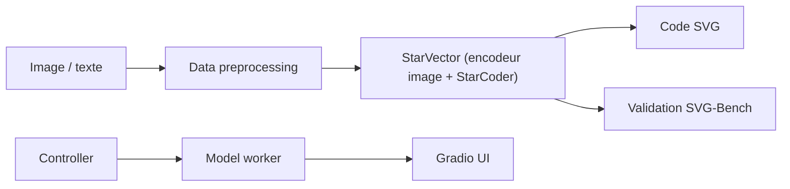

# joanrod/star-vector

> Modèle multimodal qui génère du code SVG à partir d'une image ou d'un texte.

## Le problème
Les vectoriseurs classiques suivent les courbes sans comprendre l'image, avec des artefacts et peu de primitives SVG.

## Ce que ça fait vraiment
StarVector projette l'image en tokens visuels et génère directement le code SVG avec un LLM de type StarCoder (versions 1B et 8B). Il traite image→SVG et texte→SVG. Le dépôt fournit l'entraînement (Deepspeed pour 1B, FSDP pour 8B), le banc SVG-Bench (10 jeux de données), une validation via Hugging Face ou un fork de vLLM, et une démo Gradio.

## Comment c'est branché


## Essayer
```bash
git clone https://github.com/joanrod/star-vector.git
cd star-vector
conda create -n starvector python=3.11.3 -y
conda activate starvector
pip install -e .
```

## Coût et pièges
GPU nécessaire ; l'accélération vLLM passe par un fork spécifique. Entraîner le 8B demande 8 GPU.

## Ce que ce n'est pas
Ne fonctionne pas pour des images naturelles ou des illustrations : entraîné pour icônes, logos, diagrammes, graphiques et polices.

## Alternatives
- VTracer, Potrace, AutoTrace : vectoriseurs classiques comparés dans le tableau du README.

## Pour toi
À surveiller : utile pour vectoriser icônes et diagrammes, mais restreint à ce domaine et gourmand en GPU ; les vectoriseurs classiques restent plus simples.
