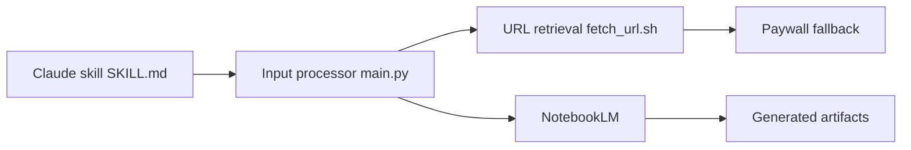

# joeseesun/qiaomu-anything-to-notebooklm

> Skill Claude Code qui convertit des contenus variés en podcast, PPT ou mind map via NotebookLM.

## Le problème
Transformer à la main des articles, vidéos et fichiers en supports de synthèse dans NotebookLM.

## Ce que ça fait vraiment
Détecte le type d'entrée (URL, fichier, recherche), récupère ou convertit le contenu, le téléverse dans NotebookLM et génère le format demandé. Un mode `--deep-analysis` pose 12 questions en trois tours. Inclut un contournement de paywalls en cascade (6 niveaux), un MCP WeChat et un MCP Feishu.

## Comment c'est branché


## Essayer
```bash
cd ~/.claude/skills/
git clone https://github.com/joeseesun/qiaomu-anything-to-notebooklm
cd qiaomu-anything-to-notebooklm
./install.sh
notebooklm login
```

## Coût et pièges
Compte Google NotebookLM ; clés Get笔记 pour les podcasts. La fonction de contournement de paywalls pose un problème juridique et éthique : le README la limite à un usage personnel.

## Ce que ce n'est pas
Pas un outil indépendant : il dépend de NotebookLM et de sa CLI non officielle. Dernier push en avril 2026.

## Alternatives
Cite Bypass Paywalls Clean, markitdown et notebooklm-py comme briques ou inspirations.

## Pour toi
À ignorer : dépend d'un service fermé et contourne des paywalls ; préférer des pipelines RAG ou de synthèse que tu maîtrises.

