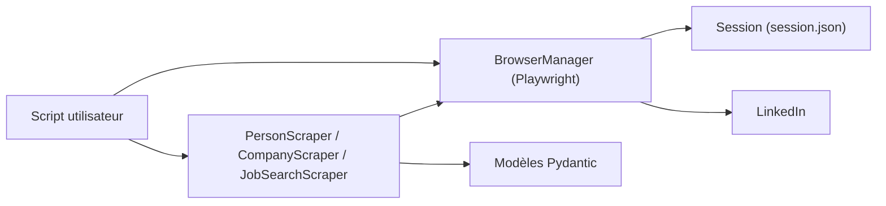

# joeyism/linkedin_scraper

> Bibliothèque Python asynchrone pour extraire profils, entreprises et offres de LinkedIn avec Playwright.

## Le problème
Récupérer de façon programmatique des données LinkedIn qui n'ont pas d'API ouverte.

## Ce que ça fait vraiment
Depuis la v3, elle pilote un navigateur Playwright avec une session authentifiée sauvegardée, et expose des scrapers (`PersonScraper`, `CompanyScraper`, `JobSearchScraper`, `CompanyPostsScraper`) qui renvoient des modèles Pydantic. Elle inclut des callbacks de progression et des exceptions typées. La v3 n'est pas compatible avec la v2 (Selenium) ; le schéma GitDiagram décrit encore la v2.

## Comment c'est branché


## Essayer
```bash
pip install linkedin-scraper
playwright install chromium
python3 samples/create_session.py
python3 samples/scrape_person.py
```

## Coût et pièges
Demande un compte LinkedIn connecté ; risque de limitation ou de blocage de compte. Le README limite l'usage à l'éducation et renvoie aux conditions de LinkedIn.

## Ce que ce n'est pas
Pas une API officielle : le scraping peut enfreindre les conditions d'utilisation de LinkedIn. Licence GPL-3.0.

## Alternatives
Aucune alternative nommée dans le README.

## Pour toi
À ignorer : risque de conditions d'utilisation et de compte bloqué, licence GPL, et tout ce qu'elle apporte dépend d'un site qui change ; passe par des sources de données déclarées.
