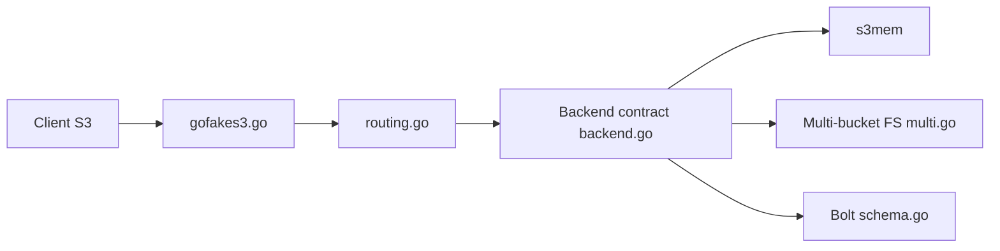

# johannesboyne/gofakes3

> Faux serveur S3 en Go pour tester en local du code qui lit ou écrit dans S3.

## Le problème
Tester du code qui accède à S3 sans compte AWS ni coûts, de façon rapide et reproductible.

## Ce que ça fait vraiment
Serveur HTTP compatible S3 : un routeur envoie les opérations vers un backend au choix (mémoire avec versions, système de fichiers mono ou multi-bucket, Bolt). Gère les envois multiparties. S'utilise avec les SDK AWS (v1, v2, JavaScript) en pointant l'endpoint vers le serveur, avec adressage par chemin recommandé.

## Comment c'est branché


## Essayer
```bash
docker pull johannesboyne/gofakes3
go get github.com/johannesboyne/gofakes3
```
Puis créer `s3mem.New()` et `gofakes3.New(backend)` dans ton test, comme dans l'exemple du README.

## Coût et pièges
Gratuit. Une partie de l'API S3 n'est pas implémentée et des changements incompatibles sont attendus. Aucun besoin de correction, de performance ni de sécurité, selon l'auteur.

## Ce que ce n'est pas
Pas un stockage de production : un faux S3 fait pour les tests.

## Alternatives
MinIO (plus complet, qualifié de « pas similaire mais puissant ») et andrewgaul/s3proxy, cités dans le README.

## Pour toi
À adopter pour les tests d'intégration de pipelines de données qui lisent S3 : léger, local, sans compte cloud ; passer à MinIO si le besoin dépasse l'API couverte.

