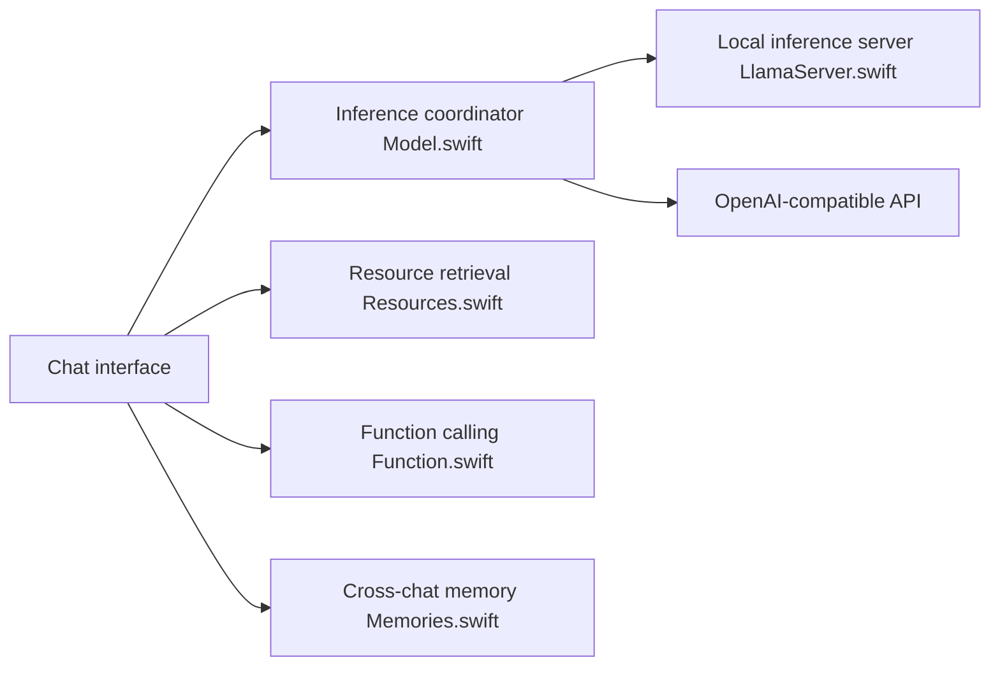

# johnbean393/Sidekick

> Application macOS de chat avec un LLM local, ancrée dans tes fichiers, dossiers et sites.

## Le problème
Interroger ses documents avec un LLM sans envoyer ses données dans le cloud demande de monter un stack RAG soi-même.

## Ce que ça fait vraiment
Appli Swift avec moteur `llama.cpp` intégré (modèles GGUF, décodage spéculatif). Des « experts » regroupent fichiers, dossiers et sites indexés (RAG) avec citations cliquables ; recherche web, appels de fonctions en boucle, Deep Research (50-80 pages), mémoire inter-conversations, Canvas d'édition, génération d'images (macOS 15.2+ avec Apple Intelligence). Clés API possibles pour OpenAI, Anthropic, etc.

## Comment c'est branché


## Essayer
```bash
brew install --cask arcadi4/tap/sidekick
./setup.sh
```
Le deuxième est la commande développeur ; ouvrir ensuite le projet dans Xcode.

## Coût et pièges
Mac Apple Silicon, 8 Go de RAM minimum. Les modèles locaux se téléchargent. Les modèles distants consomment tes clés. Le dernier push date de mai 2026.

## Ce que ce n'est pas
Pas multi-plateforme. La promesse « ressources illimitées » repose sur le RAG, sans garantie de qualité de réponse.

## Alternatives
- FreeChat : projet dont Sidekick s'inspire.

## Pour toi
À surveiller si tu es sur Mac et veux un chat local sur tes documents ; sinon préfère un backend exposé en API.

