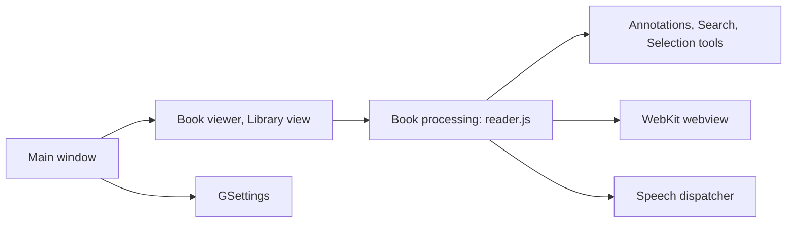

# johnfactotum/foliate

> Lecteur de livres numériques pour le bureau GNOME (GTK4, libadwaita).

## Le problème
Lire des livres électroniques sur Linux avec un rendu soigné et de vraies fonctions de lecture.

## Ce que ça fait vraiment
Le README est court : dépendances d'exécution (gjs, GTK4, libadwaita, WebKitGTK 6.0), dépendances optionnelles (règles de césure, `speech-dispatcher`, `tracker`) et modes d'installation. D'après l'architecture décrite d'après le code, l'app propose annotations, recherche, synthèse vocale, thèmes, catalogues OPDS et outils de sélection ; le rendu passe par WebKit. Ces éléments ne sont pas détaillés dans le README.

## Comment c'est branché


## Essayer
```bash
git clone --recurse-submodules https://github.com/johnfactotum/foliate.git
gjs -m src/main.js
meson setup build
sudo ninja -C build install
sudo snap install foliate
```

## Coût et pièges
Gratuit ; sous-modules Git obligatoires. Lancé depuis les sources avec `gjs`, les réglages ne sont pas sauvegardés sans compiler le schéma. Le README annonce gjs ≥ 1.82, le graphe généré cite 1.76 : suivre le README.

## Ce que ce n'est pas
Ce n'est pas multiplateforme : outil GNOME/Linux. Ce n'est pas un outil d'extraction ou d'analyse de texte.

## Alternatives
Aucune alternative nommée dans le README.

## Pour toi
Ignorer : lecteur d'ebooks pour poste Linux, hors périmètre data/IA/MLOps.

