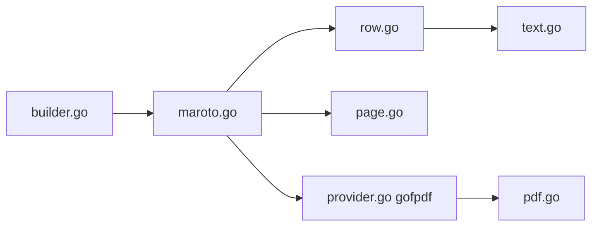

# johnfercher/maroto

> Bibliothèque Go pour générer des PDF avec une grille lignes/colonnes à la Bootstrap.

## Le problème
Produire des PDF (factures, rapports) en Go oblige à positionner chaque élément à la main.

## Ce que ça fait vraiment
On compose un document en lignes, colonnes et composants (texte, image, code-barres), avec pagination automatique, en-têtes et pieds de page répétés. Le moteur de rendu repose sur gofpdf. Le dépôt prévoit aussi polices personnalisées, cache d'images, génération de code et un décorateur de métriques.

## Comment c'est branché


## Essayer
```bash
go get github.com/johnfercher/maroto/v2@v2.4.2
```

## Coût et pièges
Gratuit. Le README est court : l'usage détaillé est dans la documentation externe.

## Ce que ce n'est pas
Pas un convertisseur HTML vers PDF : on construit le document par code. Hors écosystème Go.

## Alternatives
Aucune alternative nommée ; la v1 existe encore dans une branche.

## Pour toi
À surveiller : pratique pour générer des rapports PDF depuis un service Go, mais sans objet si ta pile est Python.

