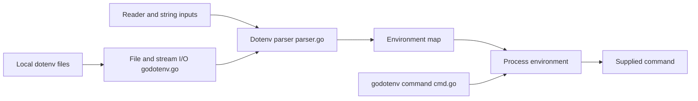

# joho/godotenv

> Portage Go de dotenv : charge les variables d'un fichier `.env` dans l'environnement.

## Le problème
Définir les variables d'environnement à la main sur chaque poste de dev ou CI est pénible et source d'erreurs.

## Ce que ça fait vraiment
`godotenv.Load()` lit `.env` (ou plusieurs fichiers) et injecte les variables sans écraser celles existantes ; `Overload()` pour forcer.
Parser gérant commentaires, `export`, guillemets, style YAML, substitution de variables.
Lecture depuis fichier, `io.Reader` ou chaîne ; écriture/marshal vers `.env`.
Commande `godotenv -f fichier commande` pour lancer un processus avec cet environnement.

## Comment c'est branché


## Essayer
```bash
go get github.com/joho/godotenv
go install github.com/joho/godotenv/cmd/godotenv@latest
godotenv -f /some/path/to/.env some_command with some args
```

## Coût et pièges
Gratuit, stdlib Go uniquement. Le binaire n'est pas garanti sous Windows.

## Ce que ce n'est pas
Pas un gestionnaire de secrets : les `.env` restent en clair. Compatibilité de noms de clés alignée sur Node, pas Ruby.

## Alternatives
Aucune nommée (le projet se présente comme portage de dotenv Ruby).

## Pour toi
À ignorer : brique Go mûre et stable, mais ton écosystème Python dispose déjà de python-dotenv pour le même usage.
