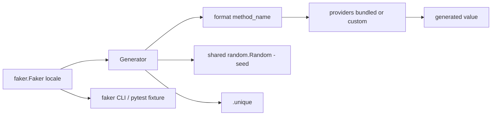

# joke2k/faker

> **One sentence.** A Python generator of fake data — names, addresses, text, profiles — to seed a database, run tests, or anonymize an extract.

## The problem

Without it you hand-write throwaway data to bootstrap a database, build good-looking XML
documents, stress-test a persistence layer, or anonymize data taken from a production
service. Hand-written fixtures stay narrow, are rarely localized, and rot quickly.

## What it actually does

`faker.Faker()` builds a generator whose properties are named after the kind of data you
want: `fake.name()`, `fake.address()`, `fake.text()`. Every call yields a different random
result, because the call is forwarded to `faker.Generator.format(method_name)`.
The individual "fakes" are packaged into providers (`name`, `address`, `lorem`, `internet`…)
that you register with `add_provider`, including your own (`BaseProvider`) or dynamic ones
(`DynamicProvider`, reading elements from an external source).
A locale argument (`Faker('it_IT')`, or a list of locales since v3.0.0) returns localized
data, falling back to `en_US` when no localized provider exists.
`.unique` guarantees unique values for that instance; `Faker.seed()` and `seed_instance()`
make a draw reproducible. The package also ships a `faker` command line and a pytest plugin
exposing a `faker` fixture.

## How it is wired



No code-derived diagram exists on disk for this repository; the nodes above come from the
pieces the README names (`faker.Generator`, `faker.generator.random`, providers, `.unique`).

## Trying it

```bash
pip install Faker
```

```python
from faker import Faker
fake = Faker()

fake.name()
fake.address()
fake.text()
```

```console
$ faker address
$ faker -l de_DE address
$ faker profile ssn,birthdate
$ faker -r=3 -s=";" name
```

Repository tests: `tox`. Provider documentation: `python -m faker > docs.txt`.

## Cost and gotchas

Free, MIT, no key and no third-party service. Since 5.0.0 it needs Python 3.8 or above (use
3.0.1 if you are stuck on Python 2). The former name `fake-factory` was deprecated by the end
of 2016: check that nothing in your dependency tree still pulls it. `use_weighting=True` is
the default and matches real-world frequencies, but the selection process is slower without
it set to `False`. Seeded results are not guaranteed to stay consistent across patch
versions, so pin the version down to the patch if you hardcode results in tests. `.unique`
raises `UniquenessException` after a number of attempts and only accepts hashable arguments
and return values — collisions come sooner than you would expect.

## What it is not

It is not an anonymizer: it produces plausible values, with no referential consistency
between calls and no mapping back to the real data it replaces. It is not an object factory
either — wiring fakes into your models goes through `factory_boy`. And values are not unique
by default: you have to go through `.unique` explicitly.

## Alternatives

Named in the README, but in other languages: `fzaninotto/Faker` (PHP), `stympy/faker` (Ruby)
and Data-Faker (Perl) — same intent, pick the one matching your project's language.
`FactoryBoy/factory_boy` is not a competitor but the object-side complement: it already
ships integration through `factory.Faker`.

## Why it matters to you

For a data / MLOps profile this is the default fixture brick: seeding databases, reproducible
test sets via `seed`, localized synthetic data to exercise a pipeline. Do not mistake it for
a compliance-grade anonymization tool.
