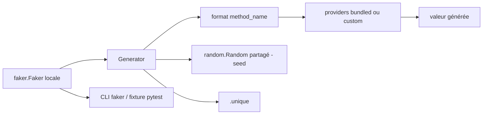

# joke2k/faker

> **Une phrase.** Générateur Python de données factices — noms, adresses, textes, profils — pour remplir une base, tester ou anonymiser.

## Le problème

Sans lui, on écrit à la main des jeux de données bidon pour amorcer une base, fabriquer des
XML de test, stresser une couche de persistance ou anonymiser un extrait de production. Ces
fixtures écrites à la main sont peu variées, peu localisées, et se périment vite.

## Ce que ça fait vraiment

`faker.Faker()` crée un générateur dont chaque propriété porte le nom du type de donnée
voulu : `fake.name()`, `fake.address()`, `fake.text()`. Chaque appel renvoie un résultat
aléatoire différent — l'appel est relayé à `faker.Generator.format(method_name)`.
Les « fakes » sont regroupés en *providers* (`name`, `address`, `lorem`, `internet`…), qu'on
peut ajouter avec `add_provider`, y compris des providers maison (`BaseProvider`) ou
dynamiques (`DynamicProvider`, éléments lus d'une source externe).
Un argument de locale (`Faker('it_IT')`, ou une liste de locales depuis la v3.0.0) renvoie
des données localisées, avec repli sur `en_US` si la locale n'a pas de provider.
`.unique` garantit des valeurs uniques pour l'instance ; `Faker.seed()` et `seed_instance()`
rendent un tirage reproductible. Le paquet fournit aussi une commande `faker` et un plugin
pytest exposant une fixture `faker`.

## Comment c'est branché



Diagramme absent du disque pour ce dépôt : les nœuds ci-dessus sont repris des éléments
nommés dans le README (`faker.Generator`, `faker.generator.random`, providers, `.unique`).

## Essayer

```bash
pip install Faker
```

```python
from faker import Faker
fake = Faker()

fake.name()
fake.address()
fake.text()
```

```console
$ faker address
$ faker -l de_DE address
$ faker profile ssn,birthdate
$ faker -r=3 -s=";" name
```

Tests du dépôt : `tox`. Documentation des providers : `python -m faker > docs.txt`.

## Coût et pièges

Gratuit, MIT, aucune clé ni service tiers. Depuis la 5.0.0, Python 3.8 minimum (3.0.1 pour
qui reste en Python 2). L'ancien nom `fake-factory` est déprécié depuis fin 2016 : vérifier
qu'aucune dépendance ne le tire encore. `use_weighting=True` par défaut cale les fréquences
sur le réel mais ralentit la sélection. Les résultats d'un même *seed* ne sont pas garantis
entre versions correctives : épingler la version au patch si on code en dur des résultats de
test. `.unique` lève `UniquenessException` après un certain nombre d'essais, et n'accepte que
des arguments et retours hachables — le paradoxe des anniversaires arrive plus vite qu'on ne
croit.

## Ce que ce n'est pas

Ce n'est pas un anonymiseur : il génère des données plausibles, il ne garantit ni cohérence
référentielle entre appels, ni correspondance avec la donnée réelle qu'on remplace. Ce n'est
pas non plus une fabrique d'objets — l'intégration avec les modèles passe par `factory_boy`.
Enfin les valeurs ne sont pas uniques par défaut : il faut passer explicitement par `.unique`.

## Alternatives

Nommés dans le README, mais dans d'autres langages : `fzaninotto/Faker` (PHP), `stympy/faker`
(Ruby) et Data-Faker (Perl) — mêmes intentions, à choisir selon le langage du projet.
`FactoryBoy/factory_boy` n'est pas un concurrent mais le complément côté objets : il embarque
déjà l'intégration via `factory.Faker`.

## Pour toi

Pour un profil data / MLOps, c'est la brique de fixtures par défaut : amorçage de bases,
jeux de test reproductibles via `seed`, données synthétiques localisées pour éprouver un
pipeline. À ne pas confondre avec un outil d'anonymisation conforme.
