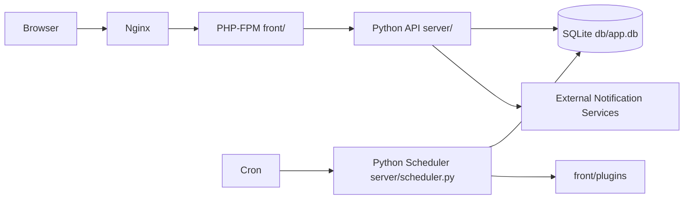

# jokob-sk/NetAlertX

> Application auto-hébergée qui inventorie les appareils d'un réseau local et alerte sur les arrivées ou changements.

## Le problème
Sans inventaire continu, on ignore quels appareils sont branchés au réseau, lesquels sont nouveaux ou non autorisés, et l'IP qu'ils occupent.

## Ce que ça fait vraiment
Un conteneur unique fait tourner Nginx, PHP-FPM, cron et un serveur Python. Des plugins (arp-scan, import Pi-hole, DHCP, UniFi, SNMP) alimentent une base SQLite. L'interface web liste les appareils, leur présence et leurs changements. Des notifications partent via Apprise, Pushover, NTFY ou webhooks ; des workflows classent ou nettoient les appareils ; des « Sync Nodes » remontent l'inventaire de plusieurs sites vers un hub.

## Comment c'est branché


## Essayer
```bash
docker run -d \
  --network=host \
  --restart unless-stopped \
  --cap-add=NET_RAW \
  --cap-add=NET_ADMIN \
  --cap-add=NET_BIND_SERVICE \
  -v /local_data_dir:/data \
  -v /etc/localtime:/etc/localtime:ro \
  --tmpfs /tmp:uid=20211,gid=20211,mode=1700 \
  -e PORT=20211 \
  -e APP_CONF_OVERRIDE='{"GRAPHQL_PORT":"20214"}' \
  ghcr.io/netalertx/netalertx:latest
```

## Coût et pièges
Gratuit ; demande Docker en réseau hôte et des capacités réseau étendues (NET_RAW, NET_ADMIN). Le dossier de données doit contenir `config` et `db`, à sauvegarder. Le README signale un changement récent du docker-compose : lire le guide de migration.

## Ce que ce n'est pas
Ni un système de supervision d'infrastructure complet (Zabbix, Nagios) ni un SIEM. La découverte de réseau ne doit se faire que sur des réseaux dont on a la responsabilité. Il n'y a pas d'authentification forte native : le README recommande un reverse proxy avec authentification.

## Alternatives
- NetBox : référence pour la source de vérité réseau et l'IPAM.
- Zabbix ou Nagios : supervision d'infrastructure plus large.
- Fing : scanner commercial, propriétaire.

## Pour toi
À surveiller : utile pour un homelab ou un parc à inventorier, mais hors du cœur data/IA/MLOps, et porté par un seul mainteneur sous GPL-3.0.
