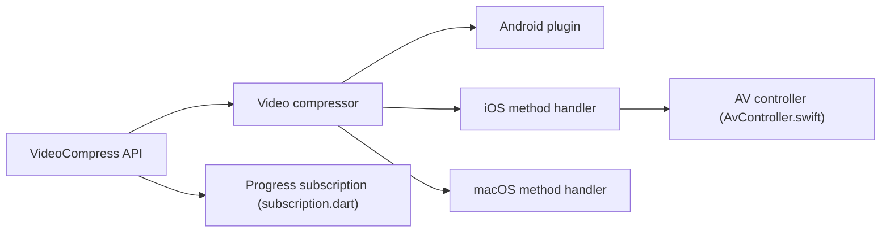

# jonataslaw/VideoCompress

> Plugin Flutter qui compresse des vidéos et génère des miniatures avec le code natif Android, iOS et macOS.

## Le problème
Compresser une vidéo dans un format lisible partout, sans embarquer FFmpeg lourd et sous licence GNU.

## Ce que ça fait vraiment
Appelle le code natif de chaque plateforme (AVFoundation sur Apple) depuis Dart : compression en MP4/AAC, miniatures en mémoire ou en fichier, informations médias, suivi de progression, nettoyage du cache. Annulation sur Android et découpe listées en « TODO ».

## Comment c'est branché


## Essayer
```bash
pub get
```
```dart
MediaInfo mediaInfo = await VideoCompress.compressVideo(path, quality: VideoQuality.DefaultQuality, deleteOrigin: false);
```

## Coût et pièges
Gratuit. Dépendance `video_compress: ^3.1.0` dans pubspec.yaml. Desktop : macOS seulement. 208 issues ouvertes, dernier push le 2025-02-13.

## Ce que ce n'est pas
Pas un transcodeur universel : un seul format de sortie, MP4/AAC. Pas de Windows ni Linux.

## Alternatives
flutter_video_compress (rurico), dont il s'inspire, basé sur FFmpeg.

## Pour toi
À ignorer : plugin mobile Flutter sans lien avec ton métier, et peu entretenu depuis plus d'un an.

