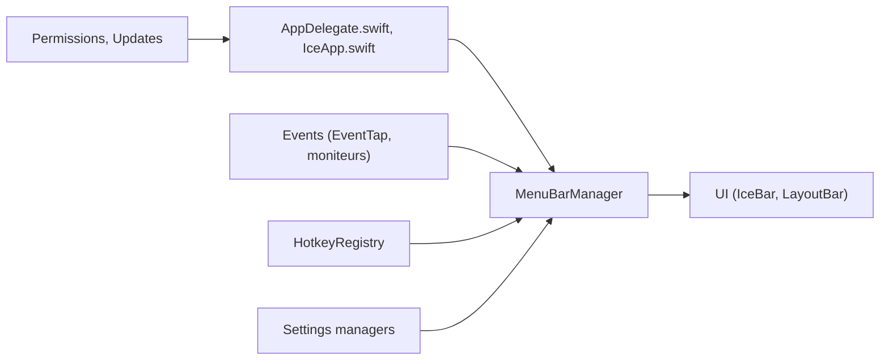

# jordanbaird/Ice

> Application macOS pour masquer, réorganiser et personnaliser les icônes de la barre de menus.

## Le problème
La barre de menus macOS se remplit d'icônes, et l'encoche des MacBook en masque une partie.

## Ce que ça fait vraiment
Masque des icônes dans une section repliable ou toujours masquée, les révèle au survol, au clic ou au défilement, ou dans une barre séparée sous la barre de menus. Réorganisation par glisser-déposer, recherche d'icônes, espacement, teinte, ombre, bordure et formes personnalisées, raccourcis clavier, lancement à l'ouverture de session et mises à jour automatiques. Plusieurs fonctions restent à cocher (profils, groupes).

## Comment c'est branché


## Essayer
```bash
brew install --cask jordanbaird-ice
```
Installation manuelle : télécharger Ice.zip depuis la dernière version et le placer dans Applications.

## Coût et pièges
Gratuit. Dernier push le 2025-09-20, soit plus d'un an, alors que le README parle de développement actif. Licence GPL-3.0. Le code indique macOS 14 ou plus.

## Ce que ce n'est pas
Pas un outil de productivité au sens large : uniquement la barre de menus macOS. Des fonctions annoncées ne sont pas implémentées.

## Alternatives
Aucune alternative citée dans le README.

## Pour toi
À ignorer : utilitaire macOS sans lien avec data/IA/MLOps, et sans commit depuis plus d'un an.

