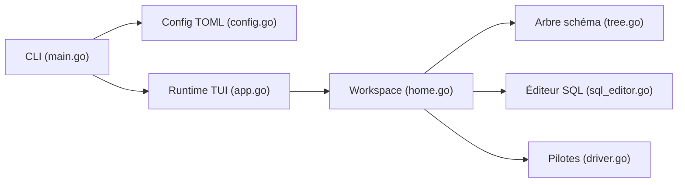

# jorgerojas26/lazysql

> Client SQL en terminal inspiré de Lazygit, pour développeurs qui vivent dans le shell.

## Le problème
Les clients SQL graphiques sont lourds, et le terminal manque d'un outil comparable à Lazygit pour parcourir tables et requêtes.

## Ce que ça fait vraiment
Interface TUI en Go avec raccourcis Vim, plusieurs connexions, onglets, éditeur SQL, arbre de schéma, tables éditables (insertion, modification, suppression en attente de validation), filtres WHERE, historique de requêtes, visionneuse JSON, export CSV. Pilotes : PostgreSQL, MySQL, SQLite, SQL Server, ClickHouse, Oracle (URL d'exemple). Mode lecture seule, commandes préalables (tunnel SSH, port-forward) et variables d'environnement en configuration TOML.

## Comment c'est branché


## Essayer
```bash
brew install lazysql
go install github.com/jorgerojas26/lazysql@latest
lazysql --read-only [connection_url]
```

## Coût et pièges
Gratuit. Le README indique un stade ALPHA et des bugs connus. Le mot de passe dans l'URL doit venir de `${env:VAR}` plutôt que d'être écrit en clair.

## Ce que ce n'est pas
Pas de création de table depuis l'interface (passe par l'éditeur SQL). Pas un outil d'administration ni de migration.

## Alternatives
Mitzasql et Gobang (listés dans le README).

## Pour toi
À essayer pour explorer rapidement entrepôts et bases de features depuis un terminal ; active le mode lecture seule sur les bases de production.

