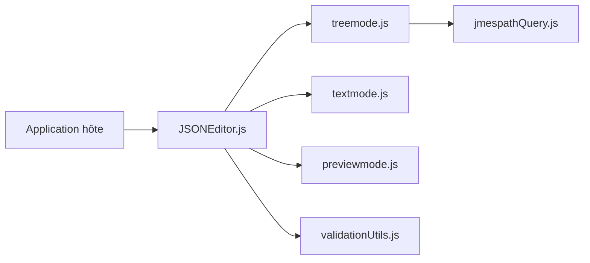

# josdejong/jsoneditor

> Composant web pour voir, éditer, formater et valider du JSON, en modes arbre, code, texte et aperçu.

## Le problème
Éditer du JSON à la main dans une interface web, avec validation, est pénible sans composant dédié.

## Ce que ça fait vraiment
Mode arbre (ajout, déplacement, tri, undo/redo, recherche, requêtes JMESPath), mode code (Ace), mode texte, mode aperçu (documents jusqu'à 500 Mio). Réparation du JSON et validation par schéma via ajv. Le README annonce un successeur, svelte-jsoneditor, qui n'est pas un remplacement strict.

## Comment c'est branché


## Essayer
```bash
npm install jsoneditor
npm run build
npm test
```

## Coût et pièges
Gratuit. Navigateurs testés : Chrome, Firefox, Safari, Edge.

## Ce que ce n'est pas
Pas un éditeur autonome : c'est un composant à intégrer. Le projet est à l'origine de jsoneditoronline.org.

## Alternatives
- svelte-jsoneditor : successeur cité dans le README.

## Pour toi
À ignorer en priorité : utile seulement si tu construis une interface web qui édite des configs ou des schémas JSON.

