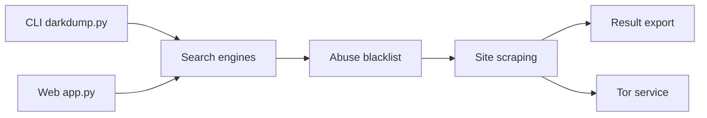

# josh0xA/darkdump

> Outil OSINT qui interroge des moteurs de recherche du dark web et extrait emails, métadonnées et documents.

## Le problème
Enquêter sur le dark web demande d'interroger plusieurs moteurs onion et d'extraire les indices à la main.

## Ce que ça fait vraiment
Six moteurs (Ahmia par défaut, notevil, tordex, tor66, onionland, excavator) sont interrogés, les résultats filtrés contre la liste noire d'abus d'Ahmia, puis, au choix, scrapés (emails, liens, documents, images). Un mode d'analyse de fuites de données, des exports JSON/CSV/TXT, une CLI et une interface web locale en flux. Proxy Tor via le port de contrôle.

## Comment c'est branché


## Essayer
```bash
git clone https://github.com/josh0xA/darkdump
cd darkdump
chmod +x install.sh
./install.sh
darkdump-cli -q "privacy tools" -a 10
```

## Coût et pièges
Gratuit ; Tor à configurer (`ControlPort 9051`). Quatre moteurs ne filtrent pas : risque de contenus illégaux ; l'usage est ton affaire juridique.

## Ce que ce n'est pas
Pas un outil de pentest ni de protection : le filtrage est reconnu imparfait par l'auteur. Réservé à la recherche légitime.

## Alternatives
Aucune alternative nommée dans le README.

## Pour toi
À ignorer : usage OSINT spécialisé, hors périmètre data/IA, avec risques juridiques sur les moteurs non filtrés.

