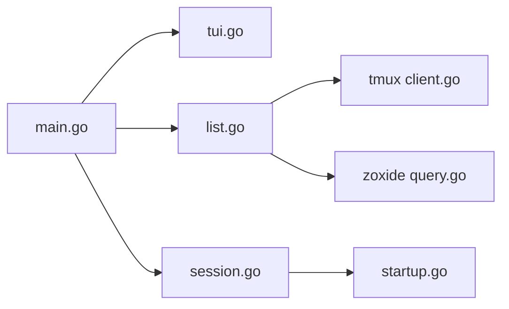

# joshmedeski/sesh

> CLI Go qui crée et bascule rapidement entre sessions tmux, en s'appuyant sur zoxide.

## Le problème
Naviguer entre projets dans tmux oblige à taper des commandes longues et à nommer chaque session à la main.

## Ce que ça fait vraiment
`sesh list` rassemble sessions tmux, dossiers zoxide, sessions configurées et tmuxinator ; `sesh connect` rejoint ou crée la session, nommée d'après le dépôt git ou le dossier. Configuration `sesh.toml` : commandes de démarrage, fenêtres, jokers de chemins, alias, aperçus. Sélecteur intégré ou fzf, television, gum. Gère aussi des worktrees liés aux issues/PR GitHub, et fournit un skill pour agents de code.

## Comment c'est branché


## Essayer
```sh
brew install sesh
sesh list
sesh connect $(sesh list | fzf)
```

## Coût et pièges
Gratuit. Nécessite tmux et zoxide installés ; `gh` pour les fonctions GitHub. Le cache est signalé expérimental.

## Ce que ce n'est pas
Pas un multiplexeur : il pilote tmux (ou un équivalent compatible via `tmux_command`). Le support d'autres multiplexeurs reste une intention du README.

## Alternatives
t-smart-tmux-session-manager (le plugin précédent de l'auteur, cité dans le README).

## Pour toi
À adopter si tu vis dans tmux sur des serveurs ou des projets multiples : l'installation est triviale et le gain de temps immédiat.

