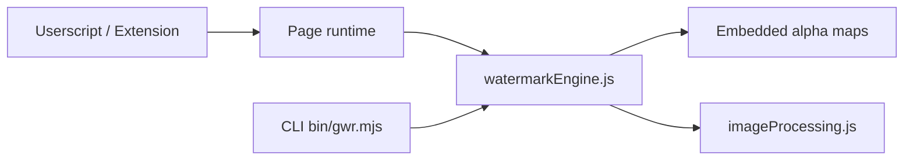

# journey-ad/gemini-watermark-remover

> Outil local retirant le filigrane visible des images et vidéos générées par Gemini : site, extension, CLI.

## Le problème
Les images générées par Gemini portent un logo semi-transparent en bas à droite, que l'on veut parfois retirer sans retouche approximative.

## Ce que ça fait vraiment
- Inverse la composition alpha du logo (formule de « reverse alpha blending ») au lieu d'un remplissage par IA, avec des masques calibrés.
- Détecte la taille et la position du filigrane via un catalogue de tailles de sortie Gemini, puis une recherche locale et une validation.
- Livré en userscript, extension Chrome, CLI (`gwr remove`), SDK JavaScript et skill pour agents ; traitement local, sans envoi de fichier.
- Ne retire pas les marques invisibles (SynthID) ; la vidéo passe surtout par le site en ligne.

## Comment c'est branché


## Essayer
```bash
node bin/gwr.mjs remove <input> --output <file>
pnpm dlx @pilio/gemini-watermark-remover remove <input> --output <file>
pnpm install && pnpm build
```

## Coût et pièges
Gratuit. Le README renvoie vers des services tiers (sites en ligne, pilio.ai) et demande d'installer `sharp` pour la CLI.

## Ce que ce n'est pas
Ce n'est pas anodin juridiquement : retirer un filigrane peut contrevenir aux conditions d'usage ou à la loi selon le pays et l'usage ; le README met la responsabilité sur l'utilisateur. Il ne supprime pas les marqueurs invisibles.

## Alternatives
Gemini Watermark Tool d'Allen Kuo, dont ce dépôt est le portage JavaScript.

## Pour toi
Ignorer : sans rapport avec le travail data/IA/MLOps, et le retrait de marquage de provenance pose un problème de traçabilité des contenus synthétiques.

