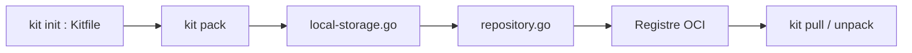

# jozu-ai/kitops

> CLI de packaging et versionnage de projets IA/ML en artefacts OCI, pour MLOps et équipes plateforme.

## Le problème
Poids, jeux de données, code et configs voyagent séparément ; impossible de les versionner, signer et déployer comme une seule unité.

## Ce que ça fait vraiment
Empaquette un projet en ModelKit (ou ModelPack CNCF) décrit par un Kitfile et stocké dans n'importe quel registre OCI. Commandes `pack`, `push`, `pull`, `unpack` sélectif, `inspect`, `diff`, `list`, `init`, import depuis Hugging Face. Digests SHA-256, signature Cosign, intégrations MLflow, GitHub Actions, KServe, Kubeflow, init container. SDK Python PyKitOps.

## Comment c'est branché


## Essayer
```bash
kit init .
kit pack
kit push
kit pull
kit inspect
```

## Coût et pièges
Gratuit ; il faut un registre OCI existant. Les fonctions de gouvernance avancées (politiques, scan) relèvent de Jozu Hub, produit distinct.

## Ce que ce n'est pas
Pas un registre de modèles ni un outil d'entraînement : il empaquette et distribue. Il ne remplace pas MLflow, il s'y intègre.

## Alternatives
- ModelPack (CNCF) : format neutre pris en charge par la même CLI.

## Pour toi
À adopter si tu dois livrer des modèles en production : OCI, signature et audit s'insèrent dans une chaîne CI/CD existante, sous gouvernance CNCF.

