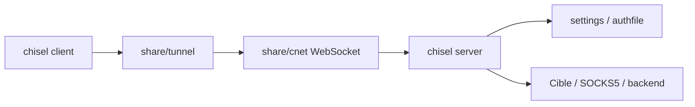

# jpillora/chisel

> Tunnel TCP/UDP sur HTTP, sécurisé par SSH, en un seul exécutable, pour traverser des pare-feux.

## Le problème
Un service derrière un pare-feu ou un NAT est inaccessible, et ouvrir des ports n'est pas toujours permis.

## Ce que ça fait vraiment
Un binaire Go faisant client et serveur : plusieurs tunnels sur une connexion TCP, transport WebSocket/HTTP, chiffrement SSH, authentification par fichier d'utilisateurs, empreinte du serveur, redirection inverse, proxy SOCKS5, reconnexion automatique avec attente exponentielle, TLS (dont Let's Encrypt) et mode `stdio` pour `ssh ProxyCommand`.

## Comment c'est branché


## Essayer
```bash
docker run --rm -it jpillora/chisel --help
chisel server --port 443 --tls-domain chisel.example.com --auth user:pass
chisel client --auth user:pass https://chisel.example.com R:2222:localhost:22
```

## Coût et pièges
Les motifs de l'authfile ne sont pas ancrés : les ancrer (`^…$`). SOCKS5 exige désormais une entrée `socks`. Une chaîne `--auth` sans deux-points fait échouer le démarrage. Certains PaaS n'acceptent pas WebSocket.

## Ce que ce n'est pas
Ce n'est pas un VPN complet ni un outil d'anonymat. Le client ne redémarre pas magiquement un serveur : `--fingerprint` est « fortement recommandé » pour éviter l'interception.

## Alternatives
Aucune alternative nommée dans le README.

## Pour toi
À surveiller : pratique pour atteindre un notebook, une base ou un GPU distant derrière un pare-feu, à condition de bien configurer l'authentification.

