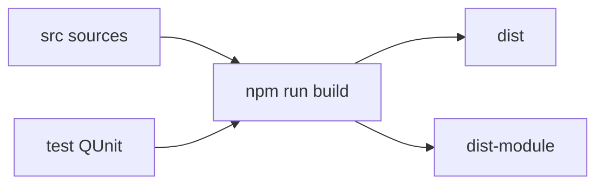

# jquery/jquery

> Bibliothèque JavaScript pour manipuler le DOM, les événements et les requêtes AJAX, à usage de développeurs web.

## Le problème
Écrire du code de manipulation de page compatible avec plusieurs navigateurs demandait beaucoup d'adaptations.

## Ce que ça fait vraiment
Ce README est surtout un guide de contribution : construire jQuery (`npm run build`), générer des variantes (slim, module ESM, mode factory), exclure des modules (ajax, css, effets, sélecteur…) et lancer la suite de tests QUnit avec un serveur PHP. Les modules décrits couvrent noyau, sélecteur, manipulation, événements, AJAX, CSS et effets.

## Comment c'est branché


## Essayer
```bash
cd jquery
npm install
npm run build
npm run build:all
```

## Coût et pièges
Gratuit. Les builds personnalisés non officiels ne sont pas testés régulièrement (le README le dit). Tests : serveur PHP requis.

## Ce que ce n'est pas
Ce n'est pas un framework d'application ; le README n'explique pas comment l'utiliser, seulement comment le construire. Composants du graphe : aucun lisible.

## Alternatives
Aucune alternative nommée dans le README.

## Pour toi
Ignorer : bibliothèque web sans lien avec la donnée ou l'IA.

