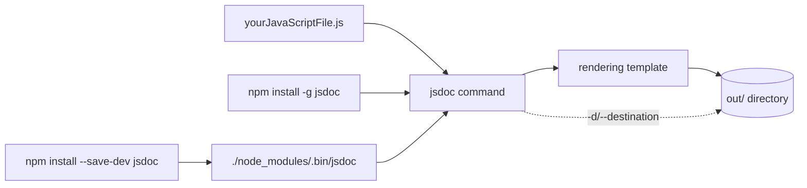

# jsdoc/jsdoc

> **An API documentation generator for JavaScript**, run from the command line, for people who annotate their source with comments.

## The problem

Without it, the API documentation of a JavaScript codebase lives apart from the code and drifts:
nothing turns source comments into browsable pages. The README says no more about the problem
than its one-line introduction, "An API documentation generator for JavaScript".

## What it actually does

JSDoc reads the JavaScript files given as arguments and writes documentation pages. By default
the output goes to a directory named `out`; the `--destination` (`-d`) option selects another
one. The full list of command-line options comes from `jsdoc --help` — the README does not
enumerate them. Rendering can be changed with third-party templates (jaguarjs-jsdoc, DocStrap,
jsdoc3Template, minami, docdash, tui-jsdoc-template, better-docs), listed in the README but
maintained outside this repository. The annotation syntax itself is not described here; it is
documented at jsdoc.app.

## How it is wired

No GitDiagram diagram exists for this repository; this graph is built from the README.



## Trying it

Commands copied from the README:

```bash
npm install -g jsdoc
npm install --save-dev jsdoc
./node_modules/.bin/jsdoc yourJavaScriptFile.js
jsdoc yourJavaScriptFile.js
jsdoc --help
```

## Cost and gotchas

Free, under the Apache License 2.0. Node.js is required: the README claims support for stable
versions "8.15.0 and later", a dated baseline worth checking before relying on it. A global
install "might require `sudo`", with a link to the npm page about EACCES errors. The README
recommends pinning with the tilde operator (`~3.6.3`) rather than the caret (`^3.6.3`) that npm
adds by default. No service cost, no API key, no telemetry mentioned.

## What it is not

It is not a ready-made documentation website or a server: the tool writes files into a
directory, and publishing them is up to you. It is also not the repository of JSDoc's own
documentation, which lives in `jsdoc/jsdoc.github.io`. Templates and build plugins (Grunt,
Gulp, GitHub Action) are third-party projects whose upkeep does not depend on this repository.
Nothing in the README mentions TypeScript or type checking — this generates pages, it does not
analyse types.

## Alternatives

The README names `jsdoc-to-markdown` (jsdoc2md), preferable when Markdown output is wanted
instead of HTML pages, and the DocStrap or docdash templates when only the rendering is at
stake. Among the catalogue neighbours there is no comparable alternative: PrismJS/prism
highlights code rather than documenting an API, and the others are off topic.

## Why it matters to you

Limited interest for a data / AI / MLOps profile, where documentation tooling is usually Python
side. Useful occasionally if you publish a JavaScript library — the front end of a dashboard,
say — and want API pages derived from source comments.
