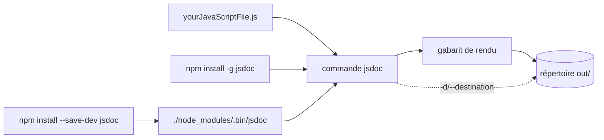

# jsdoc/jsdoc

> **Générateur de documentation d'API pour JavaScript**, en ligne de commande, pour qui annote son code en commentaires.

## Le problème

Sans lui, la documentation d'une API JavaScript vit à côté du code et diverge : rien ne
transforme les commentaires du source en pages consultables. Le README ne détaille pas le
problème au-delà de sa phrase d'introduction : « An API documentation generator for JavaScript ».

## Ce que ça fait vraiment

JSDoc lit un ou plusieurs fichiers JavaScript passés en argument et écrit un ensemble de pages
de documentation. Par défaut, la sortie est déposée dans un répertoire nommé `out` ; l'option
`--destination` (`-d`) permet d'en choisir un autre. La liste complète des options en ligne de
commande s'obtient par `jsdoc --help` — le README ne l'énumère pas. Le rendu est pilotable par
des gabarits tiers (jaguarjs-jsdoc, DocStrap, jsdoc3Template, minami, docdash,
tui-jsdoc-template, better-docs), listés par le README mais non maintenus dans ce dépôt.
La syntaxe des annotations elle-même n'est pas décrite ici : elle renvoie à jsdoc.app.

## Comment c'est branché

Aucun diagramme GitDiagram n'existe pour ce dépôt ; ce schéma est construit depuis le README.



## Essayer

Commandes copiées du README :

```bash
npm install -g jsdoc
npm install --save-dev jsdoc
./node_modules/.bin/jsdoc yourJavaScriptFile.js
jsdoc yourJavaScriptFile.js
jsdoc --help
```

## Coût et pièges

Gratuit, sous licence Apache 2.0. Il faut Node.js : le README annonce la prise en charge des
versions stables « 8.15.0 and later », un socle qui date et qu'il faut vérifier avant d'y
compter. L'installation globale « might require `sudo` », avec un lien vers la page npm sur les
erreurs EACCES. Le README recommande d'épingler la version avec le tilde (`~3.6.3`) plutôt que
le caret (`^3.6.3`), npm posant le caret par défaut. Aucun coût de service, aucune clé d'API,
aucune télémétrie mentionnée.

## Ce que ce n'est pas

Ce n'est pas un site de documentation clé en main ni un serveur : l'outil produit des fichiers
dans un répertoire, la mise en ligne reste à ta charge. Ce n'est pas non plus le dépôt de la
documentation de JSDoc elle-même, qui vit dans `jsdoc/jsdoc.github.io`. Les gabarits et les
plugins de build (Grunt, Gulp, GitHub Action) sont des projets tiers : leur maintenance ne
dépend pas de ce dépôt. Enfin, rien dans le README ne parle de TypeScript ni de vérification
de types — c'est un générateur de pages, pas un analyseur.

## Alternatives

Le README cite `jsdoc-to-markdown` (jsdoc2md), à préférer si la sortie voulue est du Markdown
plutôt que des pages HTML, ainsi que les gabarits DocStrap ou docdash quand seul le rendu est
en cause. Parmi les voisins du catalogue, aucune alternative comparable : PrismJS/prism colore
du code sans documenter d'API, les autres sont hors sujet.

## Pour toi

Intérêt limité pour un profil data / IA / MLOps, où l'outillage de doc est plutôt Python.
Utile ponctuellement si tu publies une bibliothèque JavaScript — par exemple le front d'un
tableau de bord — et que tu veux des pages d'API dérivées des commentaires du source.
