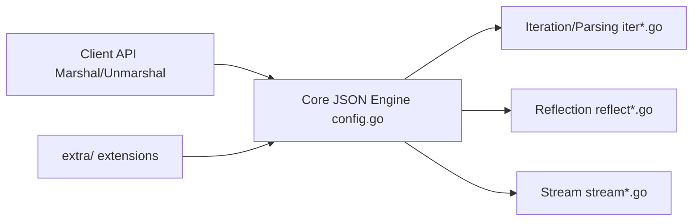

# json-iterator/go

> Remplacement compatible d'encoding/json en Go, plus rapide, pour développeurs Go.

## Le problème
Le paquet JSON standard de Go est lent et alloue beaucoup sur les charges lourdes.

## Ce que ça fait vraiment
Fournit `jsoniter.ConfigCompatibleWithStandardLibrary` qui remplace `json.Marshal` et `json.Unmarshal`. Le README donne un benchmark : décodage 5 623 ns/op contre 35 510 pour la lib standard sur une charge moyenne, avec la mise en garde de tester sa propre charge. Le code combine parseur par itérateur, réflexion, flux et extensions.

## Comment c'est branché


## Essayer
```bash
go get github.com/json-iterator/go
```
```go
import jsoniter "github.com/json-iterator/go"
var json = jsoniter.ConfigCompatibleWithStandardLibrary
json.Marshal(&data)
```

## Coût et pièges
Gratuit. Dépôt archivé, dernier push le 2024-05-27, 272 issues ouvertes sans suite possible.

## Ce que ce n'est pas
Pas maintenu : les correctifs ne viendront plus. Le gain dépend fortement des données.

## Alternatives
easyjson, comparé dans le benchmark : génération de code statique, décodage plus rapide que la lib standard.

## Pour toi
À ignorer : archivé et ancien ; pour un service Go, mesure plutôt les options encore vivantes.

